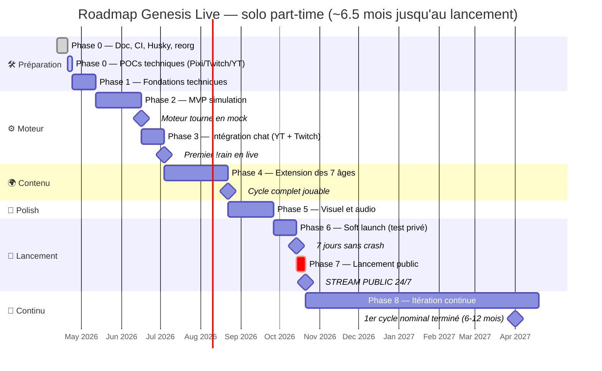

# 🗓️ GENESIS LIVE — Roadmap d'implémentation

*Plan de production solo part-time. Chaque phase liste en mots ce qu'il faut implémenter, semaine par semaine, sans code mais avec assez de détail pour savoir précisément quoi faire.*

---

## 📖 Table des matières

1. [Vue d'ensemble](#vue-densemble)
2. [Philosophie de production](#philosophie-de-production)
3. [Comment lire cette roadmap](#comment-lire-cette-roadmap)
4. [Phase 0 — Préparation](#phase-0--préparation)
5. [Phase 1 — Fondations techniques](#phase-1--fondations-techniques)
6. [Phase 2 — MVP simulation](#phase-2--mvp-simulation)
7. [Phase 3 — Intégration chat](#phase-3--intégration-chat)
8. [Phase 4 — Extension des âges](#phase-4--extension-des-âges)
9. [Phase 5 — Polish visuel et sonore](#phase-5--polish-visuel-et-sonore)
10. [Phase 6 — Soft launch](#phase-6--soft-launch)
11. [Phase 7 — Lancement public](#phase-7--lancement-public)
12. [Phase 8 — Itération continue](#phase-8--itération-continue)
13. [Jalons critiques](#jalons-critiques)
14. [Risques et mitigation](#risques-et-mitigation)
15. [Budget temps](#budget-temps)

---

## Vue d'ensemble

### Diagramme de la roadmap

### Timeline globale

| Phase | Durée | Livrable principal |
|-------|-------|---------------------|
| 0 — Préparation | 1-2 sem. | Doc, CI, outillage, POCs techniques |
| 1 — Fondations | 2-3 sem. | Monorepo, backend + frontend hello world, WS, SQLite |
| 2 — MVP simulation | 4-6 sem. | Tick loop, 3 âges, 20 commandes mock |
| 3 — Intégration chat | 2-3 sem. | Adapters YouTube + Twitch, PI, cooldowns |
| 4 — Extension des âges | 6-8 sem. | 7 âges jouables, apocalypses, cycles |
| 5 — Polish | 4-6 sem. | Assets, audio, cinématiques, caméra |
| 6 — Soft launch | 2-3 sem. | Stream privé 7 jours sans crash |
| 7 — Lancement | 1 sem. | Stream public 24/7 ouvert |
| 8 — Itération | Continu | Améliorations cycle après cycle |

**Total estimé** : 22-32 semaines à 20 h/sem = **~6-9 mois**.

### Dépendances entre phases

```mermaid
flowchart LR
    P0["Phase 0<br/>Setup"] --> P1["Phase 1<br/>Fondations"]
    P1 --> P2["Phase 2<br/>MVP simulation"]
    P2 --> P3["Phase 3<br/>Chat YT + Twitch"]
    P3 --> P4["Phase 4<br/>7 âges"]
    P4 --> P5["Phase 5<br/>Polish"]
    P4 -.->|parallélisable| P5a["Assets graphiques"]
    P5a -.-> P5
    P5 --> P6["Phase 6<br/>Soft launch"]
    P6 --> P7["Phase 7<br/>Lancement"]
    P7 --> P8["Phase 8<br/>Itération continue"]

    classDef core fill:#f59e0b,stroke:#b45309,color:#111,stroke-width:2px
    classDef parallel fill:#94a3b8,stroke:#475569,color:#fff,stroke-dasharray:5 5
    classDef launch fill:#dc2626,stroke:#7f1d1d,color:#fff,stroke-width:3px

    class P0,P1,P2,P3,P4,P5,P6,P8 core
    class P5a parallel
    class P7 launch
```

---

## Philosophie de production

**1. Fonctionnel avant beau.** La simulation doit tourner avant d'être belle.

**2. Démo-able chaque semaine.** Quelque chose de visible à la fin de chaque itération.

**3. Profondeur avant largeur.** Un âge complet > sept âges à moitié implémentés.

**4. Tester tôt et avec du public.** Mini-stream de test dès Phase 3.

**5. MVP imparfait et visible > rêve parfait et caché.**

### Principes de priorisation

Pour chaque feature : critique ? (la simulation vit sans ?) → différenciante ? → impact/effort → risque à dé-risquer vite.

---

## Comment lire cette roadmap

Chaque phase se découpe en semaines. Chaque semaine indique :

- **Objectif** de la semaine en une phrase.
- **Dépendances** : docs à relire avant de coder.
- **À implémenter** : liste descriptive de chaque module à produire, avec son rôle et ses responsabilités principales. Pas de code, juste ce que ça doit faire.
- **À tester** : les comportements à valider par tests unitaires ou d'intégration.
- **Definition of Done** : checklist concrète pour considérer la semaine terminée.

---

## Phase 0 — Préparation

**Durée** : 1-2 semaines • **Objectif** : être prêt à coder efficacement

### État au 2026-04-19 — essentiellement terminée

Documentation, repo GitHub, outillage qualité (Husky, lint-staged, commitlint, markdownlint, lychee, GitHub Actions, templates) et environnement de dev sont en place. Voir [README.md](../README.md) et [CONTRIBUTING.md](../CONTRIBUTING.md).

### Reste à faire — les 3 POCs techniques

Chaque POC vit dans une branche jetable ou un dossier `pocs/` gitignoré. Le but est **de valider une brique critique**, pas de produire du code final.

#### POC 1 — Pixi.js

Confirmer que Pixi.js v7+ tourne à 60 FPS stables avec les réglages pixel art (anti-aliasing désactivé, scale mode `NEAREST`, `roundPixels` activé, `backgroundAlpha` à zéro). Afficher un sprite 16×16 net (pas flou) et une animation 4 frames qui boucle proprement à 10 FPS. Mesurer les FPS sur 5 minutes en continu. Vérifier que la fenêtre se capture correctement dans OBS via Window Capture sans glitch d'alpha.

#### POC 2 — Bot Twitch

Créer une app Twitch Developer, obtenir un OAuth token. Connecter `tmi.js` à un channel test en moins de 3 secondes. Quand un user tape `!hello`, le bot répond en moins de 500 ms. Mesurer la latence avec `Date.now()` sur l'event reçu. Couper le process bot, le relancer, vérifier que la reconnexion est automatique. Capturer aussi les events `subscription`, `resub`, `cheer` dans un log pour valider le format.

#### POC 3 — YouTube Live Chat API

Créer un projet Google Cloud, activer YouTube Data API v3, générer une clé. Récupérer le `liveChatId` depuis une vidéo connue, puis poller les messages toutes les 3 secondes. Mesurer le coût en quota sur 1 heure de poll actif (objectif : rester sous 400 unités/h pour tenir dans les 10 000/jour). Détecter les événements de subscription et de superchat.

### Critères de succès Phase 0

Les commits passent la CI sans intervention. La doc est auto-suffisante. Les 3 POCs valident leurs hypothèses sur ma machine. Décision go/no-go Phase 1 prononcée explicitement.

---

## Phase 1 — Fondations techniques

**Durée** : 2-3 semaines • **Objectif** : squelette fonctionnel prêt à recevoir du code métier

### Dépendances à relire

[architecture.md §Organisation des fichiers](architecture.md#organisation-des-fichiers) et [coding_best_practices.md §Spécifique aux projets temps-réel](coding_best_practices.md#spécifique-aux-projets-temps-réel--simulation).

### Semaine 3 — Monorepo + backend hello world (~80% fait)

**Déjà livré** : monorepo npm workspaces (shared, backend, frontend), TypeScript 5.6 strict, `npm run build` qui compile les 3 workspaces. Backend avec Express, route `/health`, route racine, gestion des 404, WebSocket `/ws` avec welcome + echo, logger Pino + pino-pretty en dev, dotenv avec validation typée, shutdown graceful SIGTERM/SIGINT. 13 tests vitest verts (env vars + routes HTTP).

**Reste** :

- Pousser une PR complète et confirmer que les 3 jobs CI (markdown lint, link check lychee, code-checks Node) passent verts sur le même run.
- Ajouter à la racine un script `npm run dev` qui lance backend et frontend en parallèle (via `concurrently` ou équivalent), pour ne plus avoir à ouvrir deux terminaux.

### Semaine 4 — Frontend Pixi + WebSocket client

**Objectif** : le navigateur affiche une planète placeholder, se connecte au backend, se reconnecte automatiquement en cas de coupure.

**À implémenter** :

- **Initialisation Pixi.js** côté frontend : ajouter Pixi v7+ aux dépendances, configurer l'application avec la résolution logique 640×360, le mode pixel art strict (no anti-aliasing, nearest neighbor), et le fond transparent pour OBS.
- **Planète placeholder** : un grand cercle coloré au centre du canvas qui « respire » légèrement (scale 0.98 ↔ 1.02 toutes les 3 s). Une fonction publique permet de changer la couleur selon l'âge en cours.
- **Client WebSocket** : module qui établit la connexion à `ws://localhost:3000/ws`, dispatche les messages typés vers les handlers du frontend, et gère la reconnexion avec un backoff exponentiel + jitter (1 s, 2 s, 4 s, 8 s… plafonné à 60 s, plus un jitter aléatoire). Le client expose `connect()`, `disconnect()`, `send()`.
- **Orchestrateur frontend** : le point d'entrée crée l'application Pixi, la planète placeholder, le client WebSocket, et wire les événements (réception de messages → update du rendu).
- **Heartbeat backend** : le serveur WebSocket envoie un ping typé toutes les 5 secondes à tous les clients connectés. Le frontend l'affiche en console pour valider la liaison.
- **Types partagés** : étendre le package `shared` avec les types de messages WebSocket entrants/sortants (`welcome`, `heartbeat`, `state_update`, `event`, `age_transition`).

**À tester** : la logique de backoff du client WebSocket en isolation, en mockant l'objet `WebSocket` natif.

**Definition of Done** : `npm run dev` à la racine lance backend + frontend, l'ouverture de `localhost:5173` montre le cercle qui respire, la console reçoit les heartbeats, et un Ctrl+C sur le backend déclenche une reconnexion automatique du frontend dans les 5 secondes après le redémarrage.

### Semaine 5 — SQLite + migrations + premier repository

**Objectif** : persistance prête, première migration appliquée au démarrage, premier repository fonctionnel.

**À implémenter** :

- **Connexion SQLite singleton** : module qui crée et expose une instance unique `better-sqlite3` configurée en mode WAL avec `foreign_keys` activées. Le chemin du fichier vient d'une variable d'environnement.
- **Système de migrations** : un orchestrateur qui lit tous les fichiers `.sql` numérotés sous `migrations/`, les applique dans l'ordre s'ils n'ont pas déjà été enregistrés dans la table `schema_version`, et logue chaque application.
- **Migration initiale** : crée la table `schema_version` (numéro, date, description), puis les tables `cycle` (méta du cycle en cours), `planet_state` (état singleton), `viewer` (profil unifié) et `viewer_platform` (lien viewer ↔ plateforme avec contrainte d'unicité). Insère la version 1 dans `schema_version` à la fin.
- **Interface Repository générique** : un contrat minimal avec `findById`, `findAll`, `save`, hérité par tous les repositories spécifiques.
- **ViewerRepo** : implémente la recherche par ID, par couple plateforme/platformId, par pseudo, et propose `createNew` pour insérer un nouveau viewer avec sa première plateforme liée. Une méthode `updateLastSeen` met à jour la date de dernière activité. Une méthode `awardPI` provisoire incrémente les PI (sera remplacée en Phase 3 par un PIManager transactionnel).
- **Variable d'env** `DB_PATH` ajoutée à la config typée, défaut `./data/genesis.sqlite`.

**À tester** : que la migration crée bien les 5 tables sur une DB temporaire et incrémente `schema_version`. Que `ViewerRepo.createNew` puis `findByPseudo` retourne le bon viewer. Que `updateLastSeen` modifie bien le timestamp.

**Definition of Done** : au premier `npm run dev`, le dossier `./data/` est créé, le fichier SQLite aussi, la migration s'applique, et je peux inspecter la base via le CLI `sqlite3` pour voir les 5 tables.

### Livrables fin de Phase 1

Monorepo opérationnel, backend et frontend qui communiquent en WebSocket avec reconnexion auto, SQLite connecté avec sa première migration et un repository, CI verte, lancement en une commande.

### Critères de succès Phase 1

Tout démarre en une commande, les tests passent localement et sur la CI, et tuer le backend ne casse pas le frontend (qui se reconnecte automatiquement).

---

## Phase 2 — MVP simulation

**Durée** : 4-6 semaines • **Objectif** : simulation autonome sans chat, 3 premiers âges

### Dépendances à relire

[simulation_rules.md](simulation_rules.md) intégralement (le cœur de cette phase), [data_model.md §Entités racines](data_model.md#entités-racines) et [§Strain](data_model.md#strain-souche---âge-iii), [coding_best_practices.md §Déterminisme](coding_best_practices.md#déterminisme-si-possible).

### Semaine 6 — RNG seedé + état planétaire + boucle de tick

**Objectif** : la boucle de simulation existe, avance d'un tick toutes les 2 secondes, maintient un état en RAM.

**À implémenter** :

- **PRNG Mulberry32 seedé** : un générateur déterministe qui expose `next()` (flottant entre 0 et 1), `nextInt(min, max)`, `pick(array)`, `pickWeighted(array, weights)`, `shuffle(array)`, et un état sérialisable pour les snapshots. Une fonction permet de restaurer le PRNG depuis son état précédent.
- **Hash déterministe** : convertit une chaîne (par exemple un pseudo de viewer) en entier reproductible, utilisé pour seeder de manière stable.
- **Types partagés étendus** : ajouter au package `shared` les types `AgeId` (les 7 âges), `Platform`, et la projection légère de l'état planétaire envoyée au frontend par WebSocket.
- **État planétaire complet** : structure typée qui contient toutes les variables canoniques (climat, biosphère, civilisation, dynamique, méta, état RNG, drapeaux d'apocalypse). Une fonction `createInitialPlanetState` produit l'état de départ d'un cycle (température 1000°C, eau 0%, âge I).
- **Event Bus interne** : un pub/sub typé qui définit un mapping entre noms d'événements (`tick:completed`, `age:transition`, `entity:created`, `apocalypse:started`, etc.) et leurs payloads. `on()` retourne une fonction de désabonnement, `emit()` notifie tous les handlers.
- **Boucle de tick** : classe avec `start`, `stop`, `pause`, `resume`. Utilise un setTimeout récursif (pas setInterval, pour éviter la dérive). Mesure la durée de chaque tick. Si un tick dépasse le hard cap (500 ms), incrémente un compteur et appelle un handler de warning. Émet `tick:completed` avec le numéro et la durée.

**À tester** : déterminisme du PRNG (même seed → même séquence sur 10 000 appels), valeurs canoniques de l'état initial, ordre d'appel et désabonnement de l'event bus, boucle de tick qui tourne 10 ticks puis s'arrête proprement.

**Definition of Done** : le backend lance la boucle, logue le numéro et la durée de chaque tick. L'état planétaire est créé en mémoire au démarrage. Aucun appel à `Math.random()` dans le moteur (vérifiable par grep).

### Semaine 7 — Les 7 phases du tick + StateManager

**Objectif** : structurer le tick en ses 7 phases canoniques (cf. [simulation_rules.md §Boucle de simulation](simulation_rules.md#boucle-de-simulation)), même vides, dans le bon ordre.

**À implémenter** :

- **Contexte de tick** : un objet passé à toutes les phases, contenant l'état planétaire courant, le PRNG, le numéro de tick, l'event bus, et la queue des commandes chat (vide en Phase 2, utilisée en Phase 3).
- **Les 7 phases** dans des fichiers séparés, dans l'ordre canonique : ingestion des commandes chat, mise à jour des entités, physique et environnement, événements aléatoires, détection de transitions (âge, apocalypse, titres), journalisation dans le HistoryLog, snapshot périodique. Chaque phase est une fonction qui prend le contexte et le mute. En Phase 2 elles sont quasi vides (logique ajoutée semaine par semaine).
- **Orchestrateur des phases** : fonction qui exécute les 7 phases dans l'ordre. Un throw dans une phase est loggé et remonte sur l'event bus mais n'arrête pas la boucle (on logue et on continue au prochain tick).
- **StateManager** : encapsule toutes les mutations sur l'état. Expose des méthodes contrôlées (`setAge`, `incrementTick`, `adjustTemperature` avec clamp, `adjustPressure` avec clamp [0, 1]). Émet automatiquement les bons events sur le bus (`age:transition` quand l'âge change). Empêche les mutations directes du dehors.

**À tester** : les 7 phases sont appelées exactement une fois par tick, dans l'ordre. Une phase qui throw n'empêche pas le tick suivant. Le `setAge` émet bien le bon event sur le bus avec from/to corrects.

**Definition of Done** : le tick loop enchaîne les 7 phases vides sans erreur. Toutes les mutations d'état passent par le StateManager.

### Semaine 8 — Règles Âge I (Feu)

**Objectif** : la planète refroidit toute seule, des météorites tombent, elle bascule en Âge II quand les conditions de [simulation_rules.md §Âge I → II](simulation_rules.md#âge-i--âge-ii--refroidissement) sont réunies.

**À implémenter** :

- **Règles passives Âge I** : à chaque tick si l'âge est I, faire baisser la température d'une valeur tirée aléatoirement entre 0.05 et 0.2 °C, augmenter la solidification de la croûte (champ ajouté à l'état), et tirer 0.5 % de chance de météorite spontanée.
- **Mécanisme d'impact de météorite** : selon une taille (small / medium / giant), ajoute une masse, augmente la température (réchauffement par friction), émet un event `event:natural` typé. Si c'est une météorite géante et que la planète n'a pas encore de Lune Jumelle, déclenche la formation de la Lune et émet un event dédié.
- **Vérification de transition Âge I → II** : retourne « doit transitionner » si température ≤ 100°C, eau ≥ 5 %, croûte solidifiée ≥ 80 %. Sinon retourne le détail des conditions non remplies pour debug.
- **Étendre l'état planétaire** avec `crustSolidification` (0 à 1) et `hasMoon` (booléen).

**À tester** : sur 10 000 ticks avec seed fixe, la température baisse au rythme attendu et les météorites tombent à la fréquence prévue. La fonction de check retourne `true` uniquement quand les 3 conditions sont réunies. La formation de la Lune ne se déclenche qu'une fois.

**Definition of Done** : je lance le backend, la température décroît visiblement dans les logs, et au bout de N ticks la planète passe Âge II avec un event émis.

### Semaine 9 — Règles Âge II (Eaux)

**Objectif** : accumulation d'eau et de complexité organique, transition Âge II → III selon [simulation_rules.md §Âge II](simulation_rules.md#âge-ii--eaux--règles-spécifiques).

**À implémenter** :

- **Règles passives Âge II** : pluie naturelle qui ajoute jusqu'à 0.05 % d'eau par tick, dérive tectonique scalaire qui s'accumule, accumulation de complexité organique (champ caché) si la température est entre 0 et 60 °C et l'eau ≥ 30 %, chance d'éclair abiogénique rare qui catalyse les molécules organiques.
- **Le Silence Bleu** : événement contemplatif déclenché une seule fois par cycle si la couverture d'eau dépasse 95 % avant l'apparition de la vie. Émet un event de catégorie `lore`.
- **Vérification de transition Âge II → III** : eau ≥ 30 %, température entre 0 et 60 °C, complexité organique ≥ 1.0, et minimum 1000 ticks dans l'âge II (pour éviter les transitions trop rapides).
- **Étendre l'état planétaire** avec `tectonicDrift`, `organicComplexity`, `silenceBleuTriggered`, et `ticksInCurrentAge` (compteur reset à chaque transition d'âge).

**À tester** : accumulation d'eau linéaire dans le temps. Le seuil organique est atteint après le nombre de ticks attendu avec seed connue. La transition II → III ne se fait pas avant `minTicks`.

**Definition of Done** : avec la même seed initiale, la simulation reproduit exactement le même cycle I/II avec les mêmes timestamps de transition (à un tick près).

### Semaine 10 — Âge III (Germes) + Pression + événements aléatoires

**Objectif** : les premières entités vivantes (`Strain`) naissent, mutent, s'éteignent. La jauge de Pression existe et conditionne les tirages d'événements.

**À implémenter** :

- **Entité `Strain`** : structure complète selon [data_model.md §Strain](data_model.md#strain-souche---âge-iii) (identité, traits biologiques, population en BigInt, habitat, généalogie). Deux fabriques : `createNaturalStrain` pour les souches apparues spontanément, `createViewerStrain` pour celles injectées par commande (Phase 3).
- **Règles passives Âge III** : pour chaque souche vivante, tous les 10 ticks calculer un fitness simple (fonction des conditions environnementales et des traits) et ajuster la population à la hausse ou à la baisse. Tirer une mutation aléatoire (0.01 % par tick par souche) qui crée une souche enfant avec 1 à 3 traits modifiés et un nom dérivé du parent (drift de caractères). Marquer extincte toute souche dont la population tombe sous 1000.
- **Compétition** : si deux souches partagent le même habitat, la moins adaptée décline plus vite que l'autre.
- **Le Premier Baiser** : tirage rare (0.0001 % par paire de souches par tick) qui fusionne deux souches en un eucaryote ancestral. La commande chat `!merge` augmentera cette probabilité de manière ponctuelle en Phase 3.
- **Vérification de transition Âge III → IV** : au moins 10 souches vivantes distinctes, au moins une eucaryote, oxygène atmosphérique ≥ 10 %.
- **Système de Pression** : règles d'évolution de la jauge [0, 1] selon [simulation_rules.md §Système de Pression](simulation_rules.md#système-de-pression). Augmentation passive avec le temps, augmentation rapide en cas de déséquilibres (températures extrêmes, surpopulation), clamp 0-1. Une fonction publique `relievePressure(amount)` permet de relâcher la pression (utilisée par les événements majeurs en Phase 4).
- **Événements aléatoires naturels** : un registre de définitions (type, sévérité, probabilité de base, âges concernés, fonction de déclenchement). À chaque tick, parcourir le registre et tirer chaque événement avec une probabilité = base × pression × multiplicateur d'âge. Les événements typiques sont : micro-météorite, éruption mineure, pluie spontanée, mutation aléatoire d'espèce, conflit tribal, découverte scientifique.

**À tester** : un scénario de 10 souches initiales sur 10 000 ticks fait émerger une dominante et en éteint au moins deux. La pression monte passivement et plus vite avec déséquilibres. Avec un PRNG contrôlé, les probabilités d'événements s'appliquent correctement.

**Definition of Done** : l'Âge III fonctionne, je vois des souches naître, se reproduire, s'éteindre. La pression évolue. Le cycle I → II → III est jouable en accéléré (intervalle de tick réduit à 50 ms pour les tests).

### Semaine 11 — Persistance SQLite + HistoryLog + diffusion WebSocket

**Objectif** : la simulation survit à un redémarrage, le frontend voit l'état évoluer en temps réel.

**À implémenter** :

- **Migration SQL 002** : crée les tables `snapshot` (cycle, tick, type ram/disk/archive, payload JSON), `history_log` (cycle, tick, catégorie, type, sévérité, acteur, cible, description, données JSON) avec leurs index, et `strain` (toutes les colonnes de l'entité, population stockée en TEXT pour les BigInt).
- **SnapshotManager** : maintient une fenêtre des 10 derniers snapshots RAM, écrit en disque tous les 1000 ticks et en archive tous les 10 000 ticks. Une méthode `loadLatest` retourne le dernier snapshot disque ou `null`. Une méthode `maybeSnapshot(state)` est appelée à chaque tick et déclenche les sauvegardes selon le numéro de tick.
- **HistoryLogger** : insertion append-only dans `history_log` avec une signature claire (cycle, tick, catégorie, type, sévérité, acteur, description, données optionnelles). Méthodes de lecture par sévérité, par cycle, par acteur.
- **StrainRepo** : CRUD complet pour les souches, avec une méthode `findAliveInCycle` pour le tick.
- **Broadcaster WebSocket** : module qui reçoit l'instance `WebSocketServer` et expose `broadcast(message)` pour envoyer à tous les clients connectés. Méthodes spécialisées `broadcastState(state)` (envoie une projection légère de l'état toutes les 10 ticks pour ne pas saturer) et `broadcastEvent(event)` (envoyé immédiatement).
- **Wiring final dans `index.ts`** : initialiser DB, appliquer migrations, créer SnapshotManager + HistoryLogger + Broadcaster, faire un recovery (charger le dernier snapshot ou créer un cycle 1), restaurer le PRNG depuis l'état sauvegardé, créer le StateManager, brancher l'event bus sur les consumers (broadcaster + logger), démarrer la boucle de tick avec une callback qui exécute les 7 phases puis appelle `maybeSnapshot`.
- **Frontend** : afficher la planète placeholder dont la couleur change selon l'âge reçu via `state_update`. Ajouter un HUD HTML minimal avec tick count, âge en cours, température, pression.

**À tester** : un snapshot RAM tous les 100 ticks, disque tous les 1000, archive tous les 10000. `loadLatest` retourne le bon état. Un test d'intégration : démarrer le backend, simuler 500 ticks, kill, relancer, et confirmer dans les logs « reprise au tick N depuis snapshot ».

**Definition of Done** : je regarde le frontend pendant 10 minutes et je vois la planète changer de couleur, les événements défiler dans le feed, la pression monter. Un Ctrl+C suivi d'un relance reprend où c'était.

### Livrables fin de Phase 2

Simulation autonome ≥ 24 h sans crash. Les 3 premiers âges (I/II/III) transitent correctement. Persistance fonctionnelle avec recovery au snapshot. Frontend qui affiche l'évolution en quasi-temps réel. PRNG seedé, simulation reproductible avec la même seed.

### Critères de succès Phase 2

24 h d'autonomie sur ma machine, timelapse 24 h → 1 min enregistré pour archive, et même seed initiale = même cycle (déterminisme prouvé).

---

## Phase 3 — Intégration chat

**Durée** : 2-3 semaines • **Objectif** : un viewer peut influencer le monde en direct

### Dépendances à relire

[chat_integration.md](chat_integration.md) intégralement, [genesis_live_commands.md §Priorité MVP](genesis_live_commands.md#priorité-dimplémentation), [content_moderation.md §Modération automatique](content_moderation.md#modération-automatique).

### Semaine 12 — Mock adapter + parser + registre

**Objectif** : la chaîne complète chat → event → simulation fonctionne en local sans dépendre d'une API externe.

**À implémenter** :

- **Types unifiés du chat** : structures pour `ChatMessage` (id, plateforme, viewer, texte, emotes, infos superchat/bits), `ViewerInfo` (pseudo, badges, statut sub/mod/VIP), `SubscribeEvent`, `DonationEvent`, `RaidEvent`. Format identique quelle que soit la plateforme source.
- **AbstractChatAdapter** : classe abstraite avec gestion du pub/sub interne, état connecté, méthodes `connect`/`disconnect`/`reconnect` à override, et helpers `onMessage`, `onSubscribe`, `onDonation`, `onRaid` qui enregistrent des handlers typés.
- **MockChatAdapter** : implémentation pour le dev local. Génère un message toutes les 1-5 secondes avec un pseudo aléatoire pris dans une liste prédéfinie (Tom, Mia, Baconkuri, Vilt…). Expose une méthode `inject(text, pseudo)` pour les tests qui pousse un message immédiatement.
- **Système d'alias multilingue** : une map qui associe les variantes de noms de commandes à leur nom canonique (`pluie` → `rain`, `guerre` → `war`, `cité` → `city`, équivalents espagnol et allemand pour les commandes essentielles). Étendue au fil des commandes implémentées.
- **CommandParser** : prend un message, vérifie qu'il commence par `!`, extrait le nom et les arguments, résout les alias, vérifie que la commande existe dans le registre. Retourne une commande parsée typée ou `null`.
- **CommandRegistry** : container qui stocke les définitions de commandes indexées par nom. Méthodes `register`, `get`, `has`, `all`. Quand on enregistre une commande avec des alias, ils sont automatiquement ajoutés à la map des alias globale.

**À tester** : le parser détecte les commandes valides, ignore les non-commandes, résout les alias correctement. Le MockAdapter émet bien des messages aux handlers enregistrés.

**Definition of Done** : le MockAdapter est branché dans `index.ts` et les messages générés sont visibles dans les logs du backend.

### Semaine 13 — Économie PI + rate limiting + 20 commandes MVP

**Objectif** : les 20 commandes MVP sont implémentées, validées, persistées, et déclenchent des effets visibles dans le monde.

**À implémenter** :

- **Migration SQL 003** : tables `viewer_action` (action complète : viewer, snapshot du pseudo au moment de l'action, type de commande, paramètres, coût PI, succès/échec, description du résultat, entité affectée, delta de pression, titre gagné éventuel) et `pi_history` (journal append-only de tous les deltas de PI avec raison, balance après, timestamp, action liée).
- **PIManager transactionnel** : méthode `award(viewerId, amount, reason, cycleId)` qui dans une transaction SQLite verrouille le viewer, vérifie que le montant n'est pas suspect (> 10 000 → throw), met à jour la balance et le lifetime, insère une ligne dans `pi_history`. Méthode `consume` symétrique qui retourne `false` si solde insuffisant. Méthode `getBalance` simple lecture.
- **Constantes de gain de PI** : un objet figé avec toutes les valeurs canoniques (1 PI/min de présence, 10 PI/message, 25 PI message qualité, 500 PI sub, 250 PI resub, 100 PI sub offert, 100 PI/euro donné, etc.) selon [chat_integration.md §Accumulation des PI](chat_integration.md#accumulation-des-pi).
- **CooldownManager** : map en mémoire indexée par `viewerId:command`, méthode `check` qui retourne `{ ok, remainingMs? }`, méthode `set` qui enregistre le timestamp courant. Cleanup périodique des entrées de plus d'une heure. Gère aussi les cooldowns globaux (toutes plateformes confondues) pour les commandes uniques par cycle.
- **RateLimiter** : limite globale de 3 commandes par viewer par minute (toutes commandes confondues). Stocke les timestamps récents par viewer, purge ceux > 60 s, refuse si au-dessus de la limite.
- **SpamDetector** : compte les violations par viewer et applique une pénalité graduelle (warning, timeout léger 5 min, moyen 30 min, sévère 24 h, ban après 5 violations consécutives). Reset après 7 jours sans nouvelle infraction.
- **CommandDispatcher** : orchestrateur central qui prend un message, le parse, résout le viewer dans la DB (créé s'il n'existe pas), applique les checks dans l'ordre (rate limit global → cooldown commande → âge valide → PI suffisants), et si tout passe enqueue la commande dans la queue partagée avec le moteur (consommée par la phase 1 du tick). Si un check échoue, peut répondre un message au chat (avec rate limit du bot) en mode silencieux pour les cooldowns et explicite pour le manque de PI.
- **20 commandes MVP** dans des fichiers séparés sous `chat/commands/` :
  - **Universelles** : `help`, `status`, `me`.
  - **Âge I** : `impact`, `volcano`, `cool`.
  - **Âge II** : `rain`.
  - **Âge III** : `seed`, `mutate`.
  - **Âge IV** : `evolve`, `spawn`.
  - **Âge V** : `tribe`, `fire`.
  - **Âge VI** : `city`, `war`, `tech`, `trade`, `plague_city`.
  - **Âge VII** : `launch`, `ai`.
  Chaque commande implémente l'interface `CommandDefinition` (nom, alias, description, coût PI, cooldown, âges où elle est dispo, fonction `validate` qui vérifie les arguments, fonction `execute` qui mute l'état et retourne le résultat).
- **Repositories** : `ViewerActionRepo` et `PIHistoryRepo` append-only (jamais de update/delete).

**À tester** : un test par commande avec validate + execute sur des entrées nominales et edge cases. Le dispatcher rejette les commandes hors âge, hors cooldown, sans PI suffisants. Spam détecté et pénalisé après 3 commandes en moins d'une minute. PI accumulés passivement (test sur la phase de présence) et consommés correctement.

**Definition of Done** : je lance le backend avec MockAdapter actif, je vois les 20 commandes s'exécuter et leurs effets se propager au frontend (couleur, événements, pression). `!rain` fait monter `waterCoverage` de manière mesurable. Un viewer qui spam est ratelimité.

### Semaine 14 — YouTube + Twitch + UnifiedChatManager

**Objectif** : deux plateformes réelles connectées, agrégées dans le même monde.

**À implémenter** :

- **YouTubeLiveAdapter** : implémentation de l'adapter qui découvre le `liveChatId` à partir d'une vidéo ou d'une chaîne, lance une boucle de poll vers `https://www.googleapis.com/youtube/v3/liveChat/messages` toutes les 3-4 secondes (intervalle ajusté selon `pollingIntervalMillis` retourné par l'API). Ajuste l'intervalle vers 10 s si erreurs. Détecte les types `textMessageEvent`, `newSponsorEvent`, `superChatEvent`, `memberMilestoneChatEvent`. Normalise chaque message vers le format unifié.
- **TwitchAdapter** : utilise `tmi.js`. Connexion IRC sécurisée avec username + OAuth + canal. Capture les événements `message`, `subscription`, `resub`, `subgift`, `cheer` (bits convertis en équivalent euros), `raided`. Normalise chaque message avec parsing des badges (sub tier, mod, VIP, broadcaster) et des emotes.
- **CircuitBreaker** : pattern qui protège des appels répétés à une API en panne. États `closed` (normal), `open` (refuse les appels pendant N secondes), `half-open` (autorise un essai puis tranche). Bascule à `open` après 5 échecs consécutifs, retente après 60 secondes. Utilisé par YouTubeLiveAdapter autour de chaque poll.
- **ViewerResolver** : reçoit une `ViewerInfo` et une plateforme, cherche d'abord par couple plateforme/platformId. Si trouvé, met à jour `lastSeenAt` et retourne. Sinon, optionnellement cherche par pseudo exact (peu fiable mais utile pour suggérer une liaison). Sinon, crée un nouveau viewer. Une méthode `proposeLink` génère une proposition de liaison cross-platform avec un code court et une expiration de 5 minutes ; la commande `!link` confirme la proposition depuis le compte cible.
- **UnifiedChatManager** : agrège plusieurs adapters dans un seul flux. Reçoit chaque message, résout le viewer unifié via le ViewerResolver, dispatche au CommandDispatcher. Sur événement `subscribe` ou `donation`, attribue automatiquement les PI selon les constantes et déclenche un événement majeur dans le monde selon l'âge en cours. Sur `raid`, distribue un bonus d'arrivée. Reconnexion en arrière-plan d'un adapter qui tombe (les autres continuent).
- **Commande `!link`** : valide les arguments `[plateforme] [pseudo]`, crée ou confirme une proposition de liaison via le ViewerResolver. Une fois confirmée, fusionne les PI et l'historique des deux viewers.

**À tester** : avec un mock de `fetch`, simuler les réponses YouTube (succès, 403 quota, timeout) et vérifier que le circuit breaker passe à `open` après 5 échecs. Avec un mock de `tmi.Client`, simuler les événements Twitch et valider le format normalisé. Un message YouTube et un message Twitch avec deux pseudos différents créent deux viewers ; après `!link` les PI sont fusionnés.

**Definition of Done** : je configure mes vraies clés YT + Twitch dans `.env`, je lance un stream test, je tape `!rain` depuis YouTube → la planète réagit. Je tape la même commande depuis Twitch → autre viewer dans la DB. `!link twitch MonPseudoTW` génère une proposition que je confirme depuis Twitch → les deux pseudos fusionnent. Un sub sur l'une ou l'autre plateforme déclenche un événement visible à l'écran.

### Livrables fin de Phase 3

Parser et registre complets, 20 commandes MVP fonctionnelles, PIManager transactionnel, rate limiter + cooldowns + spam detector, adapters YouTube + Twitch + Mock, UnifiedChatManager + ViewerResolver cross-platform.

### Critères de succès Phase 3

`!rain` tapé sur YouTube → effet visible en moins de 3 secondes. 100 commandes par minute sans crash. Un sub YT et un sub Twitch déclenchent chacun un événement visible. `!link` fonctionne et fusionne les PI.

### Moment démo

Mini-stream de 1 heure avec 5 amis sur mes canaux test. Première boucle viewer → monde en conditions réelles.

---

## Phase 4 — Extension des âges

**Durée** : 6-8 semaines • **Objectif** : les 7 âges complets avec apocalypses et cycles

### Stratégie

Avancer **un âge à la fois**. Implémenter règles → entités → commandes → tester en accéléré → valider → passer au suivant. Ne pas commencer Âge V avant que l'Âge IV tourne de manière satisfaisante.

### Dépendances à relire

[simulation_rules.md §Règles par âge](simulation_rules.md#règles-par-âge) (Âges IV à VII), [data_model.md](data_model.md) intégralement, [genesis_live_commands.md](genesis_live_commands.md) intégralement.

### Semaine 15-16 — Âge IV (Grouillement)

**À implémenter** :

- **Entité Species** : structure complète selon [data_model.md §Species](data_model.md#species-espèce---âge-iv) avec identité, généalogie, traits biologiques (taille, poids, régime, locomotion, intelligence, agressivité, taux de reproduction, lifespan, capacités spéciales), apparence (couleurs, type de corps, features), état écologique (population, biome, prédateurs, proies, compétiteurs), historique (extinction, max population), descendance vers Âge V (devenue intelligente, tribus formées).
- **SpeciesRepo** : CRUD + requêtes spécialisées (`findAliveInCycle`, `findByFounder`, `findByParent`, `findApexPredators`).
- **Règles de fitness** : fonction qui calcule un score [0, 1] selon l'adaptation au climat actuel, le ratio de ressources disponibles, le stress de prédation, les bonus de traits adaptés au biome. Au-dessus de 0.7 = prospérité, 0.3-0.7 = stabilité, sous 0.3 = déclin, sous 0.1 = extinction imminente.
- **Règles passives Âge IV** : pour chaque espèce vivante, calculer le fitness, ajuster la population, appliquer les mutations rares, gérer la compétition entre espèces du même biome, gérer la prédation, vérifier les conditions de spéciation. À l'échelle globale, déclencher les extinctions de masse si la pression dépasse 0.8 et qu'un événement catastrophique est tiré.
- **Règles de mutation** : 0.005 % par tick par espèce. Quand elle déclenche, crée une espèce enfant qui hérite de 70 % des traits, modifie 20 % et invente 10 %. Une mutation légendaire (0.0001 %) attribue un trait impossible (télépathie, base silicium, multi-corps, bioluminescence, téléport) — l'espèce devient « légendaire » dans les chroniques.
- **Règles de spéciation** : trois conditions cumulatives — isolement géographique (un seul biome) depuis plus de 10 000 ticks, accumulation de mutations (au moins 3 enfants), population suffisante (> 1000). Quand toutes sont remplies, la branche devient une nouvelle espèce avec son propre nom dérivé.
- **16 commandes Âge IV** : `evolve`, `spawn` (avec types aquatic/terrestrial/aerial/amphibian), `mutate` ciblé, `predator`, `prey`, `plant`, `forest`, `migrate`, `climate` (warming/cooling/wet/dry), `meteor`, `volcano_mass`, `flight`, `giant`, `intelligence`, `symbiosis`, `extinct_species`. La commande `intelligence` est critique : elle pousse une espèce vers `canUseTools = true` et `isSocial = true`, accumule un compteur de tentatives. Transition Âge IV → V quand le compteur atteint 20 ou par succès direct (10 % de chance par tentative).

**À tester** : scénario d'intégration de 100 000 ticks en accéléré qui démarre à l'Âge III et atteint l'Âge IV avec au moins 3 espèces vivantes. Avec seed contrôlée, sur 1 million de ticks au moins une espèce devient légendaire.

**Definition of Done** : Âge IV fonctionne, espèces visibles dans les logs et le frontend. Les 16 commandes opérationnelles. Créatures impossibles observables en mode rapide ×100. Mass extinction se déclenche sur pression élevée.

### Semaine 17-18 — Âge V (Étincelles)

**À implémenter** :

- **Entité Tribe** : selon [data_model.md §Tribe](data_model.md#tribe-tribu---âge-v), avec démographie (population, taux de naissance/mort), culture (langue, religion, traits culturels), technologies acquises (feu, langage, agriculture, métallurgie, liste d'outils), géographie (région courante, régions traversées), relations (tribus alliées, ennemies), évolution (devenue civilisation ou non).
- **Entité Language** : langue générée procéduralement avec un set de phonèmes, des préfixes/suffixes courants, une banque de mots racines, une grammaire simplifiée. Une fonction `generateLanguage` produit une langue à partir d'un pseudo fondateur et d'un PRNG. Une fonction `driftLanguage` modifie progressivement les phonèmes et les mots tous les ~100 000 ticks pour simuler la dérive linguistique.
- **Règles passives Âge V** : pour chaque tribu, faire croître la population selon naissances/morts, tirer une chance de découverte naturelle de feu/outils/langage, propager les découvertes entre tribus alliées sur N ticks, gérer les conflits tribaux selon proximité × ressources × cultures × pression.
- **Vérification de transition Âge V → VI** : au moins 3 tribus avec feu + langage + outils, au moins une avec agriculture, population totale ≥ 10 000.
- **Entité PointOfInterest** : selon [data_model.md §PointOfInterest](data_model.md#pointofinterest), pour les ruines, peintures rupestres, monuments, champs de bataille, tombes, cratères, sites d'artefacts. Champ critique `persistsAcrossCycles` qui marque les POIs réapparaissant aux cycles suivants.
- **14 commandes Âge V** : `tribe`, `fire`, `tool` (stone/wood/bone/bow/spear), `language`, `art` (crée des peintures rupestres POI persistantes), `ritual`, `bury` (étape vers la spiritualité), `migrate_tribe`, `meet` (issue aléatoire entre 2 tribus), `farm`, `domesticate`, `metallurgy`, `plague`, `hero` (désigne un viewer comme héros mythique avec persistance inter-cycles).

**À tester** : scénario qui part de 3 tribus en Âge V accéléré et valide qu'au moins une atteint feu + langage + agriculture en moins de 50 000 ticks. La commande `hero` attribue le titre `Le Légendaire` au viewer désigné et le POI créé persiste à travers les cycles.

**Definition of Done** : l'Âge V fonctionne, art rupestre visible comme POI, retrouvé dans le cycle suivant, 14 commandes opérationnelles.

### Semaine 19-21 — Âge VI (Cités)

**L'âge le plus dense narrativement, prévoir 3 semaines complètes.**

**À implémenter** :

- **Entité Civilization** : selon [data_model.md §Civilization](data_model.md#civilization-civilisation---âge-vi), avec archétype (solar/lunar/volcanic/abyssal/troglodyte/celestial), trait dominant (warlike/peaceful/mystical/mercantile/scientific/artistic), pouvoir (militaire, économique, culturel), organisation politique (type de gouvernement, capitale, cités), culture (religion dominante, langue officielle, écriture), relations diplomatiques, technologies développées, historique (peak population, peak tech, plus longue guerre).
- **Entité City** : avec géographie (région, coordonnées), appartenance à une civilisation, démographie (population, taux de croissance, bonheur), économie (richesse, production, nourriture), infrastructure (liste de bâtiments avec date de construction et de destruction), état (active, assiégée, en révolte, en ruines), relations commerciales et conflits, dynastie courante.
- **Entité Religion** : type (monothéiste, polythéiste, panthéiste, ancestrale, animiste, philosophique), divinité principale (peut référencer SOL/NOX/KHRON/VOX ou un nom personnalisé), croyances et tabous, influence (nombre de fidèles, cités converties, civilisations influencées), histoire (schismes engendrés, religion parente).
- **Entité Dynasty** : lignée royale avec succession explicite, chaque règne avec date de début, fin, cause (mort naturelle, assassinat, renversement, abdication).
- **Tirage des Destinées** : à chaque fondation de civilisation, tirer aléatoirement archétype, trait principal, longévité destinée (entre 1000 et 50 000 ticks), destin final (expansion / effondrement / transformation / isolement / conquête). Ces tirages biaisent les probabilités sans déterminer absolument.
- **Règles civilisationnelles** : pour chaque cité, calculer la croissance selon nourriture × bonheur × santé × (1 - guerre). Si le bonheur reste sous 0.3 longtemps, déclencher une rébellion. Pour chaque civilisation, gérer la diplomatie et les guerres selon les destinées et les pressions actuelles. Pour chaque religion, gérer la propagation par commerce, guerre, migration, et tirer occasionnellement des schismes selon les tensions culturelles.
- **Arbre technologique** : structure ordonnée des technologies avec leurs prérequis (bronze → iron, writing seul, wheel seul, medicine après writing, printing après writing, gunpowder après iron, steam après iron, electric après steam, nuclear et digital après electric, quantum après digital). Chaque commande `tech` débloque la suivante disponible. Les sous-âges (bronze, iron, medieval, sails, industrial, network) sont déduits du niveau tech moyen de la civilisation.
- **Découverte de ruines des cycles précédents** : commande `discover_ruins` cherche dans les POIs hérités du cycle précédent (donc disponible à partir du cycle 2), tire un POI au hasard, le marque comme découvert dans le cycle courant.
- **35 commandes Âge VI** regroupées par catégorie :
  - Fondation : `city`, `capital`, `religion`, `dynasty`.
  - Militaire : `war`, `peace`, `conquer`, `rebel`, `assassinate`.
  - Économique : `trade`, `coin`, `tax`, `famine`.
  - Tech : `tech`, `writing`, `wheel`, `medicine`, `print`, `industrial`, `electric`.
  - Culturelle : `art`, `festival`, `university`, `library`, `philosophy`, `schism`.
  - Catastrophe : `plague_city`, `flood`, `fire_city`, `earthquake`.
  - Exploratoire : `explore`, `sail`, `discover_ruins`, `colony`.
  - Spéciale : `revolution`, `genocide`, `unify`.

**À tester** : scénario complet qui démarre à l'Âge VI avec 3 cités fondées, simule 5000 ticks et vérifie qu'au moins une guerre a eu lieu et qu'une religion s'est répandue à plusieurs cités. Edge cases sur la croissance de cité (bonheur à 0, guerre permanente).

**Definition of Done** : Âge VI tourne, cycle bronze → industriel → network observable en accéléré. 35 commandes opérationnelles. Au moins un empire formé via `unify`. Religions propagées entre cités.

### Semaine 22 — Âge VII (Vide)

**À implémenter** :

- **Entités spatiales** : `Satellite` (orbite, fonction, propriétaire), `Station` (orbitale ou lunaire, capacité, équipage simulé), `Colony` (lunaire ou planétaire), `AI` (alignement parmi bienveillant/neutre/hostile/transcendant, intelligence qui croît au fil des ticks, créateur, état alive).
- **Règles passives Âge VII** : tech progresse deux fois plus vite qu'en Âge VI. Les IAs voient leur intelligence croître progressivement, et au-dessus du seuil tirent leur destin selon leur alignement. Les satellites perdent de l'altitude s'ils ne sont pas maintenus. Le Contact a une probabilité rarissime mais qui augmente avec la pollution de la planète.
- **Décision d'IA** : quand une IA atteint l'intelligence maximale, tirer son outcome — bienveillante (booste la civilisation), hostile (déclenche apocalypse Singularité), transcendante (disparaît en emportant ses créateurs).
- **Débris orbitaux** : créés en POI de type `orbital_debris` avec `persistsAcrossCycles = true`. Découvrables par les civilisations futures comme « ruines orbitales » qui révèlent l'existence de cycles précédents.
- **11 commandes Âge VII** : `launch`, `satellite`, `station`, `moon_colony`, `ai` (peut déclencher Singularité), `contact` (très dangereux, peut déclencher apocalypse Contact), `terraform`, `nuke` (cumulé peut déclencher Hiver des Cendres), `ascension`, `signal` (superchat uniquement), `warp`.

**Definition of Done** : l'Âge VII tourne, des sondes sont lancées, les IAs évoluent, le Contact peut survenir.

### Semaine 23 — 9 apocalypses + cycles + 21 titres

**À implémenter** :

- **Pattern Strategy pour les apocalypses** : une interface commune (canTrigger selon l'état, durée des 4 phases, application de chaque phase, narrative summary). 9 implémentations dans des fichiers séparés selon [genesis_live_lore.md §Apocalypses](genesis_live_lore.md#apocalypses--renaissances) :
  - `celestialImpact` — astéroïde géant + ciel obscurci.
  - `ashWinter` — guerre nucléaire globale.
  - `greenhouse` — réchauffement incontrôlé.
  - `greatPlague` — pandémie universelle.
  - `singularity` — IA prend le contrôle.
  - `finalDeluge` — océans montent.
  - `contact` — visiteurs du Vide Noir.
  - `innerCollapse` — effondrement civilisationnel lent sans cause externe.
  - `oblivion` — la planète perd sa vie sans raison apparente.
- **Sélecteur d'apocalypse** : selon l'état de la planète, biaise vers la stratégie la plus contextuelle (techLevel ≥ 9 + IA active → Singularité ; techLevel ≥ 7 + tensions militaires → Hiver des Cendres ; pollution > 0.7 → Étuve ; pandémie récente → Grande Faux ; Âge VII → 20 % de chance de Contact ; sinon tirage parmi candidates compatibles).
- **Déclenchement** : trois voies — pression ≥ 0.95 pendant > 100 ticks consécutifs (apocalypse forcée), combinaison de commandes catastrophiques (3 `nuke` dans une fenêtre temps → Hiver des Cendres garanti), ou tirage rare (0.0001 % par tick à l'Âge VII). Bascule l'état dans `isInApocalypse = true`, met `apocalypsePhase = "premise"`, émet `apocalypse:started`.
- **Avancement des phases** : phase prémisse (10 % de la durée totale, signes avant-coureurs, dernière chance d'intervention via `peace`/`terraform`), phase déclenchement (40 %, événement catastrophique commence), phase dévastation (40 %, effondrement massif), phase cessation (10 %, état final consigné, transition vers la renaissance).
- **Renaissance** : à la fin d'une apocalypse, sélectionner les survivants (espèces les plus résilientes), préserver 30 à 70 % des POIs (pourcentage tiré aléatoirement selon la sévérité), hériter 1 à 3 artefacts légendaires (Obélisque, Livre Brûlé, Cité sans Nom, Crâne Chantant, Graine Éternelle), transmettre 5 à 10 « savoirs innés » comme mythes émergents au cycle suivant. Créer un nouveau cycle avec une seed dérivée du cycle précédent. Transférer les héritages vers le nouvel état planétaire. Émettre `cycle:ended` puis `cycle:started`.
- **21 titres du Panthéon** : un registre de définitions de titres avec key, displayName, icône, catégorie (primordial/obscur/rare/interdit), une fonction `detect` qui examine le cycle terminé et retourne le viewer méritant + raison, et le timing d'attribution (immédiat / fin d'âge / fin de cycle / post-apocalypse). Persistance inter-cycles selon le titre. Voir [simulation_rules.md §Règles d'attribution](simulation_rules.md#règles-dattribution-de-titres) pour la liste complète.
- **Détection des titres** : lancée à chaque timing approprié (immédiat à chaque event matchant, en fin d'âge sur transition, en fin de cycle après apocalypse, post-apocalypse spécifiquement). Pour chaque titre, appeler `detect` ; si elle retourne un viewer, attribuer le titre via le TitleRepo et émettre `title:earned`.

**À tester** : un test par stratégie d'apocalypse vérifiant que `canTrigger` retourne vrai dans les bonnes conditions, que les 4 phases s'enchaînent dans la bonne durée, et que le `narrativeSummary` est non vide. Test de renaissance : artefacts persistent, `cycleNumber` incrémenté, héritages transférés. Test de chaque titre dans un scénario reproductible.

**Definition of Done** : en accéléré ×100, un cycle complet Âge I → VII → apocalypse → nouveau cycle se déroule en moins d'1 heure réelle. Les 9 types d'apocalypse sont déclenchables. Les 21 titres sont détectables sur les bons événements. Artefacts réapparaissent au cycle 2+.

### Livrables fin de Phase 4

7 âges complets jouables, ~130 commandes opérationnelles, 9 apocalypses + renaissance inter-cycles, 21 titres attribuables, mode accéléré (variable d'env `SPEED_MULTIPLIER=30`) fonctionnel pour les tests longs.

### Critères de succès Phase 4

Cycle complet en accéléré ×50 en 3-7 jours réels sans crash, au moins 5 types d'apocalypse observés, viewer participant au cycle 1 voit son titre persister au cycle 2.

### Moment démo

Mini-stream de 7 jours en accéléré ×30-×50 avec 10-20 viewers fidèles. Premier cycle complet en conditions quasi-réelles.

---

## Phase 5 — Polish visuel et sonore

**Durée** : 4-6 semaines • **Objectif** : produit agréable à regarder et à écouter

### Dépendances à relire

[assets_pixel_art.md](assets_pixel_art.md), [render_spec.md](render_spec.md), [audio_design.md](audio_design.md), [color_palette.md](color_palette.md).

### Semaine 24-25 — Production des assets pixel art

**À implémenter** : production ou acquisition ciblée sur le MVP de polish, en suivant la priorisation de [assets_pixel_art.md §Priorités d'implémentation](assets_pixel_art.md#priorités-dimplémentation).

- **Palette officielle** : fichier JSON listant les 64 couleurs avec leurs codes hex, nom sémantique, valeurs RGB, organisées en 8 familles. Module TypeScript dérivé qui expose un objet `COLORS` typé et une fonction de conversion vers le format Pixi (entier hex).
- **Textures planète par âge** : 7 textures finales avec animations subtiles (3 frames de respiration sur 3 secondes), une variante par état post-apocalypse principal.
- **Patches de biomes globe** : ~40 patches polygonaux avec 4-6 variantes par biome pour éviter la répétition visuelle.
- **Tilesets isométriques** : pour les 13 biomes, ~40-60 tuiles par biome en losange 32×16, incluant sols variants, transitions vers biomes voisins, reliefs, ressources, détails. Pour les biomes « eau » et « lave », tuiles animées 4 frames.
- **Sprites d'entités iso** : 12 formes de créatures de base déclinées en 4 orientations (NE, NW, SE, SW) et 3 animations (idle, walk, die). Humanoïdes tribaux Âge V avec leurs animations. Bâtiments par sous-âge Âge VI selon les stades de croissance des cités (small huts → arcology). Sprites Âge VII spatial.
- **Artefacts persistants** : 5 sprites iconiques (Obélisque, Livre Brûlé, Cité sans Nom, Crâne Chantant, Graine Éternelle) reconnaissables au premier coup d'œil.
- **Atlas TexturePacker** : grouper les sprites par famille pour optimiser les draw calls Pixi (planet_base_atlas, biomes_globe_atlas, iso_<biome>_atlas, iso_creatures_atlas, iso_cities_atlas, ui_atlas, fx_atlas).
- **Badges des 21 titres** : version 48×48 px pour le HUD et 192×192 px pour les notifications de gain, avec encadrement par catégorie (primordial bleu cosmique, obscur rouge sombre, rare doré, légendaire prismatique, interdit magenta).
- **Icônes HUD** : stats (température, eau, oxygène, pression, etc.), événements (action viewer, naissance, mort, guerre, paix, découverte, etc.), symboles d'âge alchimiques, symboles des 4 forces primordiales.

**Definition of Done** : les 7 textures planète sont intégrées, au moins 2 tilesets iso complets (forêt et océan), les 21 badges existent, les atlas sont générés et chargeables par Pixi.

### Semaine 26 — Rendu Pixi complet (projection hybride + caméra)

**À implémenter** :

- **Math isométrique** : module qui expose `worldToIso(x, y, z)` et `isoToWorld(sx, sy)` avec des constantes `TILE_WIDTH = 32` et `TILE_HEIGHT = 16`.
- **ProjectionManager** : selon la valeur du zoom, bascule entre quatre modes — spatial (zoom < 0.3, vue large incluant Soleil-Témoin et Lune Jumelle pour l'Âge VII), globe (0.3 - 0.8, disque planétaire 2D), transition (0.8 - 1.6, crossfade entre globe et iso), iso (zoom > 1.6, tilemap rapproché). Calcule un `blend` entre 0 et 1 et applique l'alpha sur les trois scènes pour le crossfade.
- **Caméra de base** : position et zoom avec lerp vers une cible. Méthodes `moveTo`, `zoomTo`, `shake` (light/medium/heavy avec durée).
- **Caméra cinématique** : alterne entre mode global (vue d'ensemble, ~80 % du temps) et mode focus (sur un point d'intérêt, 10-30 s). En mode global, après 20 secondes, cherche un événement intéressant (par ordre de priorité : événement majeur en cours, viewer actif récent, mutation, fondation de cité). En mode focus, après 15 secondes, retour automatique au global. Émet aussi des cinématiques scriptées sur transition d'âge et apocalypse.
- **Layer manager** : crée et organise les 8 layers de rendu dans le bon ordre (background → planet base → terrain → entities surface → atmosphere → entities aerial → fx foreground → ui overlay). Permet d'ajouter/retirer des sprites par layer.
- **Renderers d'entités** : un par type — speciesRenderer adapte le sprite et la densité visuelle selon la population (1 sprite si pop < seuil, jusqu'à 20 si pop dense), cityRenderer choisit le stade visuel (SMALL/MEDIUM/LARGE/HUGE/MEGA) selon la population et le sous-âge tech, tribeRenderer affiche huttes + feux + humanoïdes, strainRenderer affiche des taches colorées tintées par hash du pseudo.
- **Pool de sprites** : réutilise les sprites Pixi au lieu de les créer/détruire, pour limiter les allocations GC. `acquire(texture)` retourne un sprite du pool, `release(sprite)` le rend au pool.
- **Indicateurs visuels** : liseré coloré autour des entités fondées par viewer, couronne au-dessus des apex predators, bannière flottante au-dessus des cités capitales, halo doré sur les cités d'empire dominant, particules dorées sur les créatures légendaires, icônes religieuses au-dessus des cités converties.

### Semaine 27 — Effets, HUD complet, transitions d'âge

**À implémenter** :

- **Système de particules** : moteur simple qui gère un budget global maximal de 2000 particules simultanées. Quand on dépasse, prioriser les événements visibles et couper l'ambiance.
- **Effets d'événements** : dictionnaire qui mappe chaque type d'événement vers un emitter (rain, snow, ash, sparks…), une durée, et éventuellement un shake de caméra. Pour les apocalypses, séquences chorégraphiées multi-effets.
- **Cinématiques de transition d'âge** : 7 cinématiques de 30 à 60 secondes chacune, mixant fondu noir, banner d'âge, crossfade entre les musiques d'âge, effets visuels signature (déluge pour I→II, zoom microscopique pour II→III, premier feu pour IV→V, fondation de cité pour V→VI, ascension orbitale pour VI→VII).
- **HUD HTML/CSS complet** : top bar avec compteur de cycle, symbole et nom d'âge en cours, nom actuel de la planète, jauge de Pression colorée. Status panel à gauche avec température, population, tech level, biodiversité, etc. Top viewers à droite (classement par PI ou par titres). Event feed en bas avec auto-scroll et limite de 5 événements visibles. Composants additionnels pour notification de titre gagné, banner d'annonce d'âge plein écran, alerte d'apocalypse imminente avec banner rouge pulsant.
- **Cycle jour/nuit** : overlay shader qui module la teinte globale sur ~5 minutes (jour clair, crépuscule orange/rose, nuit bleu nuit, aube). Pendant la nuit Âges VI-VII, activer les lumières urbaines des cités.

### Semaine 28 — Audio (musique adaptative)

**À implémenter** :

- **AudioManager orchestrateur** : reçoit l'état planétaire à chaque update, dispatche aux sous-modules (musique, SFX, ambiance, mixer). Méthodes publiques `playEventSFX`, `playTitleJingle`, `playAgeTransition`.
- **MusicPlayer adaptatif** : maintient la piste de base de l'âge en cours, plus 6 layers superposables (calm, tension, urgent activés selon la pression ; population, diversity, technology activés selon les stats correspondantes). Quand l'âge change, crossfade de 3 secondes vers la nouvelle musique. Les changements de volume des layers se font par fade smooth de 2 secondes pour éviter les sauts.
- **SFX Pool** : pool de 5 instances par effet pour pouvoir jouer plusieurs occurrences simultanées sans recréation.
- **Ducker audio** : baisse automatiquement les autres layers pendant les sons importants. Cas typiques : annonce de nouveau cycle (tout duck à 80 %, narration seule), apocalypse (musique duck à 50 %), titre légendaire (ambiance duck à 30 % pendant 3 s).
- **Compresseur/limiteur final** : éviter les pics qui font sursauter, peak limit à -1 dB.

### Semaine 29 — Audio (production des stems et SFX)

**À implémenter / acquérir** :

- **7 musiques d'âge** avec layers calm/tension/urgent (donc 14 à 35 stems audio), selon les ambiances de [audio_design.md §Musique par âge](audio_design.md#musique-par-âge).
- **9 musiques d'apocalypse** avec leurs signatures sonores propres.
- **~60 SFX** : phénomènes naturels (éruption, tonnerre, tremblement, tsunami, vent, pluie, feu, geyser), vie (cris d'animaux préhistoriques et modernes, créatures impossibles), civilisations (foule, construction, cloches, batailles, industrie, moderne), spatial (fusée, satellite, IA, contact), événements narratifs (titre gagné, nouvelle espèce, fondation de cité, alerte apocalypse, transition d'âge), UI (notifications, alertes).
- **Ambiances par biome** : 12 ambiances bouclables (forêt tempérée, jungle, désert, toundra, savane, marais, montagnes, océan, lagon, récif, glacier, ville).
- **Normalisation -14 LUFS** sur tous les fichiers via script ffmpeg, pour respecter les standards de streaming YouTube et Twitch.

Sources possibles : packs libres (Sonniss GameAudio, Freesound CC0, BBC Sound Effects), composition perso, ou IA (Suno/Udio) retravaillée.

### Livrables fin de Phase 5

Style visuel cohérent palette stricte, sprites d'entités rendus en mode globe et iso, projection hybride fonctionnelle aux 3 seuils, caméra cinématique automatique, 7 transitions d'âge animées, cycle jour/nuit, bande sonore adaptative complète, HUD polished.

### Critères de succès Phase 5

Je peux regarder le stream 30 minutes sans m'ennuyer visuellement. La musique ne fatigue pas. Un non-initié comprend en 5 minutes sans explication.

### Moment démo

Trailer de 2 minutes monté depuis les moments les plus cinégéniques.

---

## Phase 6 — Soft launch

**Durée** : 2-3 semaines • **Objectif** : valider stabilité et équilibrage avant le public

### Semaine 30 — Tests techniques + monitoring

**À implémenter** :

- **Stress tests scriptés** : un script qui injecte 1000 commandes par minute via le MockAdapter pendant 48 h, mesure mémoire, CPU et latence des ticks. Un script qui ouvre 500 connexions WebSocket simultanées et vérifie que le backend tient. Un script de chaos qui kill -9 le backend toutes les 6 h et vérifie que le recovery depuis snapshot prend moins d'une minute.
- **Test de relais multistream** : configurer Restream.io avec un flux OBS test, valider que YouTube Live et Twitch reçoivent bien le même flux pendant 3 h sans interruption.
- **Endpoint d'admin protégé** : route `/admin/stats` derrière un token secret qui retourne uptime, mémoire heap utilisée, numéro de tick courant, latence p95 des ticks récents, nombre de clients WS connectés, nombre d'entités actives par type, statuts des adapters chat.
- **Dashboard de monitoring** : Grafana self-hosted ou page HTML custom qui poll l'endpoint admin toutes les 10 s et affiche les métriques sous forme de graphiques temporels.
- **Alertes Discord webhook** : déclenchées sur backend down (healthcheck externe via UptimeRobot ou équivalent), erreurs > 10/min sur les 5 dernières minutes, latence tick > 1 s en moyenne sur 10 ticks consécutifs, chat déconnecté depuis > 5 min, espace disque < 10 %.
- **Backup quotidien automatisé** : script bash lancé par cron qui exécute `sqlite3 .backup`, compresse le résultat en gzip, et l'upload vers un stockage externe (S3, BackBlaze ou équivalent). Politique de rétention rotative : 7 quotidiens, 4 hebdomadaires, 12 mensuels.

### Semaine 31 — Stream test 1 (3 jours, privé)

**À mettre en place** :

- **Invitation** de 10-20 proches par Discord et SMS.
- **Formulaire de feedback** structuré (Google Forms ou Discord) à remplir après chaque session.
- **Enregistrement** complet du stream pour analyse post-mortem.
- **Présence active** 3-4 h/jour pour observer en temps réel.
- **Journal de bugs** : chaque bug détecté noté avec tick, pseudo qui l'a déclenché, action concernée.
- **Hot-fixes** appliqués immédiatement si bloquant.

### Semaine 32 — Stream test 2 (7 jours, cercle élargi)

**À mettre en place** :

- **Invitation** de 100-200 personnes (cercle proche + communauté early via Discord).
- **Mode cycle accéléré** activé via la variable d'env `SPEED_MULTIPLIER=30` pour observer un cycle complet en 4-12 jours.
- **2 modérateurs** disponibles sur rotation.
- **Monitoring continu** sur le dashboard.
- **Patch limité aux bugs critiques** (pas de nouvelle feature, on stabilise).
- **Collecte de métriques** : retention des viewers, commandes les plus utilisées, pics d'activité.
- **Postmortem écrit** et partagé : ce qui a marché, ce qui n'a pas, ce qu'on change avant le launch.

### Livrables fin de Phase 6

7 jours sans crash > 5 min, premier cycle complet joué publiquement en accéléré, feedback classé et critique adressé.

### Critères de succès Phase 6

Uptime > 99 % sur 7 jours, ≥ 50 viewers uniques ayant interagi, ≥ 1 cycle complet terminé (apocalypse → renaissance), aucune plainte majeure non adressée.

### Moment démo

Postmortem public sur Discord et vidéo YouTube.

---

## Phase 7 — Lancement public

**Durée** : 1 semaine • **Objectif** : ouvrir au grand public

### Semaine 33 — Préparation marketing

**À mettre en place** :

- **Trailer final** d'1 à 2 minutes monté depuis les moments les plus cinégéniques de Phases 5-6.
- **Screenshots iconiques** couvrant plusieurs âges et au moins une apocalypse.
- **Description du concept** en un paragraphe incisif et FAQ pour les nouveaux viewers.
- **Branding final** : logo, wordmark, thumbnails YouTube et Twitch conformes au branding défini dans [assets_pixel_art.md §Branding](assets_pixel_art.md#assets-obs--branding).
- **Comptes vérifiés** : YouTube Live éligible 24/7, Twitch Stream Key configurée.
- **Relais multistream opérationnel** (Restream.io ou NGINX-RTMP self-hosted), test de 30 min confirmé.
- **3 à 5 modérateurs recrutés et formés** selon [content_moderation.md §Équipe de modération](content_moderation.md#équipe-de-modération).
- **Règles de chat publiques** affichées et accessibles via la commande `!rules`.
- **Canal d'appel** pour les bannis (Discord ou email dédié).

### Jour J

**Checklist 1 h avant le go live** : backend healthcheck OK, DB intègre (taille raisonnable, dernières migrations appliquées), backup récent (< 1 h), snapshot récent, dashboard de monitoring ouvert, 2 mods disponibles. Annonce sur Twitter/X, Discord et tous les canaux prévus. Présence active 4-6 h pour répondre en direct au chat.

### Semaine 34 — Première semaine publique

**À tenir** : présence 2-3 h/jour, hot-fixes uniquement si bloquant (pas de features), ajustements d'équilibrage mineurs si urgent, collecte du gros volume de feedback pour Phase 8.

### Livrables fin de Phase 7

Stream public actif, trafic organique établi, communauté en formation, premier cycle public au rythme nominal (6-12 mois) **lancé** (pas encore terminé).

### Critères de succès Phase 7

\> 500 viewers uniques la première semaine, uptime 99 % sur 7 jours, pas de crise de modération non résolue.

---

## Phase 8 — Itération continue

**Durée** : continue • **Objectif** : améliorer cycle après cycle

### Rituels

**Quotidien** : check des logs et alertes, hot-fixes, réponses au chat.

**Hebdomadaire** : review des métriques (engagement, uptime, bugs), priorisation, patch mineur déployé.

**Mensuel** : équilibrage (coûts PI, cooldowns), feature majeure ou contenu narratif ajouté.

**Par cycle** : postmortem complet, nouvelle narration ou twist dans le lore, export public des archives.

### Backlog indicatif

**Court terme (mois 7-9)** :

- Polish des assets restants (les biomes secondaires, les unités tardives Âge VI).
- Optimisations de perf (culling plus agressif, LOD iso).
- Commandes secrètes selon [genesis_live_commands.md §Commandes cachées](genesis_live_commands.md#commandes-cachées--secrètes) — `!42`, `!konami`, `!pray_to_vox`, `!break_fourth_wall`, `!remember`, `!oracle`, `!whisper`, et les commandes contextuelles déclenchées par mots-clés du chat.
- Mode accessibilité haute lisibilité (contraste augmenté, animations réduites).

**Moyen terme (mois 9-12)** :

- Wiki public auto-généré depuis le Grand Registre (site statique consommant l'API REST `/api/lore/*`).
- API publique documentée pour outils tiers.
- Événements saisonniers (Halloween, Noël) avec re-skins temporaires de la palette.
- Features communautaires (votes globaux pour décider d'actions majeures, sondages pour le nom d'une cité).

**Long terme (année 2+)** :

- Support de nouvelles plateformes (Kick, TikTok Live).
- Genesis Live Classic — replay de cycles archivés, navigation dans le passé.
- Édition communautaire (mods via scripts lua/js sandboxés).

---

## Jalons critiques

### Go/no-go

**Fin Phase 2** — Simulation tourne 24 h sans crash ? 3 âges distincts visuellement ? Toujours motivé ?

**Fin Phase 3** — Un vrai viewer peut influencer ? Pas de faille évidente ? Latence < 3 s ?

**Fin Phase 6** — Uptime > 99 % sur 7 jours ? Retours positifs ? Prêt pour le public ?

Si NON → prolonger la phase, corriger, recommencer. **Jamais forcer.**

### Jalons narratifs

- **Premier titre gagné** (Phase 3).
- **Première apocalypse publique** (Phase 6).
- **Premier cycle 2** (Phase 7).
- **Premier viewer revenu au cycle 3** (Phase 8).
- **Premier mythe émergent non prévu** (Phase 8+) — l'objectif ultime du projet.

---

## Risques et mitigation

### Techniques

- **Quota YouTube API** : demander un quota élevé en amont, optimiser les polls à 3-4 s, fallback Twitch-only si tout échoue.
- **Perf dégradée long terme** : stress tests Phase 6, monitoring continu, caps sur les entités actives selon [simulation_rules.md §Équilibrage](simulation_rules.md#équilibrage-et-tuning).
- **Bug critique en production** : snapshots fréquents, procédure de rollback testée régulièrement.
- **Injection chat** : validation stricte aux frontières, rate limiting, no-eval, audit régulier selon [architecture.md §Sécurité](architecture.md#sécurité).

### Humains

- **Burnout** : pauses planifiées, célébrer les jalons, ne pas se comparer.
- **Feature creep** : revenir aux specs, dire non aux ajouts hors phase, prioriser le lancement.
- **Perte de motivation** : livrables démo-ables hebdomadaires, communauté early dès Phase 3.

### Communautaires

- **Peu d'audience** : marketing, patience (6-12 mois pour bâtir une audience fidèle).
- **Toxicité** : modération solide dès Phase 6 selon [content_moderation.md](content_moderation.md), ban rapide, règles claires publiques.
- **Sabotage organisé** : rate limit, détection de coordination selon [chat_integration.md §Modération automatique](chat_integration.md#modération-automatique), protocoles de crise.

### Financiers

- **Infra** : VPS 10-30 €/mois + backup cloud → ~300 €/an minimum viable.
- **APIs tierces** : YouTube et Twitch sont gratuits dans les quotas standards.

---

## Budget temps

Solo à 20 h/semaine.

| Phase | Heures | Semaines |
|-------|--------|----------|
| 0 — Préparation | 20-30 h | 1-1.5 |
| 1 — Fondations | 40-60 h | 2-3 |
| 2 — MVP simulation | 80-120 h | 4-6 |
| 3 — Intégration chat | 40-60 h | 2-3 |
| 4 — Extension des âges | 120-160 h | 6-8 |
| 5 — Polish | 80-120 h | 4-6 |
| 6 — Soft launch | 40-60 h | 2-3 |
| 7 — Lancement | 20-30 h | 1-1.5 |
| **Total V1** | **440-640 h** | **22-32 sem.** |

**Répartition hebdo indicative** : 60 % code, 20 % assets/design, 10 % doc/réflexion, 10 % tests/déploiement. Alterner les jours pour éviter le burn-out.

---

## ✨ Conclusion

### Les 3 choses à retenir

1. **La priorité absolue est que la simulation tourne** (Phase 2). Tout le reste vient après.
2. **Le chat est ce qui rend le projet unique** (Phase 3). Sans lui, c'est juste un simulateur.
3. **Le soft launch est le filet de sécurité** (Phase 6). Ne jamais le sauter.

### Ce qui fait avancer le projet chaque semaine

Coder tous les jours même 30 min. Célébrer chaque jalon. Documenter les choix dans les commits. Lancer imparfait plutôt que parfait en retard.

---

*Roadmap v1.3 — document vivant, ajusté selon la réalité de la production.*
