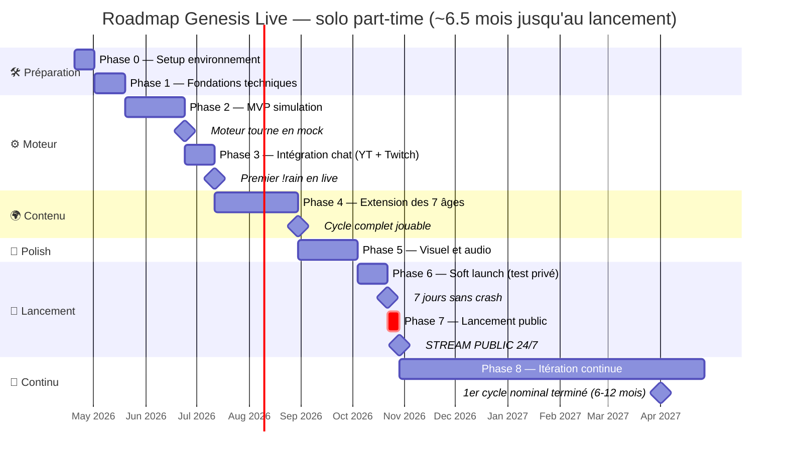
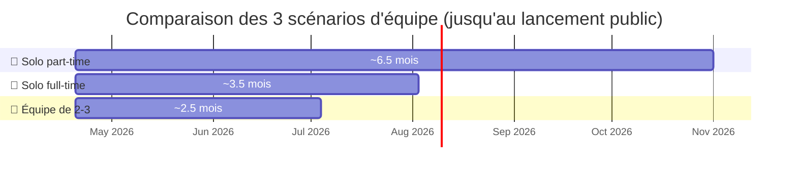
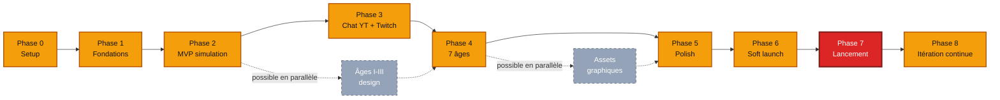

# 🗓️ GENESIS LIVE — Roadmap de production

*Plan de production complet, du premier commit au stream 24/7. Phases, jalons, risques, critères de succès.*

---

## 📖 Table des matières

1. [Vue d'ensemble](#vue-densemble)
2. [Philosophie de production](#philosophie-de-production)
3. [Phases principales](#phases-principales)
4. [Phase 0 — Préparation](#phase-0--préparation)
5. [Phase 1 — Fondations techniques](#phase-1--fondations-techniques)
6. [Phase 2 — MVP simulation](#phase-2--mvp-simulation)
7. [Phase 3 — Intégration chat](#phase-3--intégration-chat)
8. [Phase 4 — Extension des âges](#phase-4--extension-des-âges)
9. [Phase 5 — Polish visuel et sonore](#phase-5--polish-visuel-et-sonore)
10. [Phase 6 — Soft launch](#phase-6--soft-launch)
11. [Phase 7 — Lancement public](#phase-7--lancement-public)
12. [Phase 8 — Itération continue](#phase-8--itération-continue)
13. [Jalons critiques](#jalons-critiques)
14. [Risques et mitigation](#risques-et-mitigation)
15. [Répartition du travail](#répartition-du-travail)
16. [Budget temps et effort](#budget-temps-et-effort)

---

## Vue d'ensemble

### Diagramme de la roadmap



> 💡 Le diagramme utilise des **durées médianes**. Les fourchettes min-max figurent dans la table ci-dessous.
> Dates calculées à partir d'un démarrage au **20 avril 2026** en mode solo part-time.

### Timeline globale

| Phase | Durée (solo part-time) | Livrable principal |
|-------|------------------------|---------------------|
| 0 — Préparation | 1-2 semaines | Environnement prêt, specs comprises |
| 1 — Fondations | 2-3 semaines | Structure du projet, hello world |
| 2 — MVP simulation | 4-6 semaines | Simulation tourne en mock |
| 3 — Intégration chat | 2-3 semaines | YouTube/Twitch connectés |
| 4 — Extension des âges | 6-8 semaines | 7 âges complets |
| 5 — Polish | 4-6 semaines | Assets, audio, cinématiques |
| 6 — Soft launch | 2-3 semaines | Stream test avec audience limitée |
| 7 — Lancement | 1 semaine | Stream 24/7 ouvert |
| 8 — Itération | Continu | Améliorations continues |

**Total estimé** : **6 à 9 mois en solo part-time**, **3-4 mois en solo full-time**, **2-3 mois en équipe de 2-3**.

### Vue comparative des 3 scénarios



### Dépendances entre phases



### Objectifs par phase

```
Phase 0-1  ─→ "Le projet existe, je peux coder dessus"
Phase 2    ─→ "La simulation fonctionne sans chat"
Phase 3    ─→ "Le chat peut influencer le monde"
Phase 4    ─→ "Les 7 âges jouables, cycles complets"
Phase 5    ─→ "C'est beau et ça sonne bien"
Phase 6    ─→ "Ça a tourné 7 jours sans crash"
Phase 7    ─→ "Le public peut regarder en continu"
Phase 8    ─→ "Ça s'améliore à chaque cycle"
```

---

## Philosophie de production

### Les 5 règles de production

**1. Fonctionnel avant beau**
La simulation doit **marcher** avant qu'elle soit **belle**. Pas de graphismes pixel art magnifiques sans moteur derrière.

**2. Démo-able à chaque étape**
À la fin de chaque semaine, il doit y avoir **quelque chose à montrer**. Même minuscule. Ça motive et ça valide.

**3. Privilégier la profondeur à la largeur**
Mieux vaut **un âge complet et polished** que sept âges à moitié faits. Avance **en profondeur** avant d'étendre.

**4. Tester tôt, tester souvent**
Lancer des mini-streams de test dès que possible, même avec 5 viewers. L'émergence se découvre en live, pas en théorie.

**5. Accepter l'imperfection**
Le MVP doit être **imparfait et visible**, pas parfait et caché. Sortir → apprendre → améliorer.

### Anti-patterns à éviter

❌ **"Je vais tout coder avant de lancer"** → Jamais lancé
❌ **"Je vais attendre que ce soit parfait"** → Jamais parfait
❌ **"Je ferai les tests plus tard"** → Jamais testé
❌ **"Je vais faire tous les âges avant de polir"** → Abandon avant la fin
❌ **"Je m'occupe du monitoring à la fin"** → Découverte tardive de bugs

### Principes de priorisation

**Pour chaque feature**, demander :
1. **Critique** : la simulation peut-elle vivre sans ? (Si non → priorité max)
2. **Différenciante** : est-ce ce qui rend Genesis Live unique ? (Si oui → prioritaire)
3. **Impact/effort** : gros impact pour peu d'effort ? (À faire tôt)
4. **Risque** : inconnu technique qui peut tout faire capoter ? (À dé-risquer vite)

---

## Phases principales

### Vue synthétique des phases

```
┌─────────────────────────────────────────────────────────────┐
│ PHASE 0 : PRÉPARATION                                        │
│ Specs lues, outils installés, GitHub ouvert                 │
└────────────────────────┬────────────────────────────────────┘
                         ▼
┌─────────────────────────────────────────────────────────────┐
│ PHASE 1 : FONDATIONS                                         │
│ Monorepo, TS, tests, CI/CD, "hello world" de bout en bout   │
└────────────────────────┬────────────────────────────────────┘
                         ▼
┌─────────────────────────────────────────────────────────────┐
│ PHASE 2 : MVP SIMULATION                                     │
│ Moteur tick, 3 âges, état évolue en mock                    │
└────────────────────────┬────────────────────────────────────┘
                         ▼
┌─────────────────────────────────────────────────────────────┐
│ PHASE 3 : INTÉGRATION CHAT                                   │
│ YouTube + Twitch, commandes basiques, PI, rate limiting      │
└────────────────────────┬────────────────────────────────────┘
                         ▼
┌─────────────────────────────────────────────────────────────┐
│ PHASE 4 : EXTENSION DES ÂGES                                 │
│ 7 âges complets, apocalypses, cycles, titres                │
└────────────────────────┬────────────────────────────────────┘
                         ▼
┌─────────────────────────────────────────────────────────────┐
│ PHASE 5 : POLISH                                             │
│ Assets finaux, audio, cinématiques, UI aboutie              │
└────────────────────────┬────────────────────────────────────┘
                         ▼
┌─────────────────────────────────────────────────────────────┐
│ PHASE 6 : SOFT LAUNCH                                        │
│ Stream test privé, 7 jours de stabilité                      │
└────────────────────────┬────────────────────────────────────┘
                         ▼
┌─────────────────────────────────────────────────────────────┐
│ PHASE 7 : LANCEMENT                                          │
│ Stream public 24/7, marketing, communauté                    │
└────────────────────────┬────────────────────────────────────┘
                         ▼
┌─────────────────────────────────────────────────────────────┐
│ PHASE 8 : ITÉRATION                                          │
│ Cycles successifs, équilibrage, nouvelles features           │
└─────────────────────────────────────────────────────────────┘
```

---

## Phase 0 — Préparation

**Durée** : 1-2 semaines
**Objectif** : être prêt à coder efficacement

### Semaine 1 — Compréhension et setup

**Jour 1-2 — Relecture des specs**
- [ ] Relire les 9 documents de spec en entier
- [ ] Prendre des notes sur les points flous
- [ ] Identifier les risques techniques (ce qu'on ne sait pas faire)
- [ ] Lister les zones où il faudra improviser

**Jour 3-4 — Setup environnement de dev**
- [ ] Installer Node.js 20+ (via nvm recommandé)
- [ ] Installer un IDE (VS Code recommandé)
- [ ] Configurer les extensions (ESLint, Prettier, TypeScript)
- [ ] Git configuré, SSH key GitHub
- [ ] Créer le repo GitHub (privé ou public)

**Jour 5-7 — Exploration technique**
- [ ] POC : faire marcher Pixi.js avec un canvas simple
- [ ] POC : créer un bot Twitch qui réagit à "!hello"
- [ ] POC : connecter YouTube Live Chat API et recevoir des messages
- [ ] Décider de la stack finale (TypeScript confirmed ? SQLite ou PostgreSQL ?)

### Semaine 2 — Outillage et documentation

**Jour 8-10 — Documentation initiale**
- [ ] README.md du projet
- [ ] CONTRIBUTING.md si open source
- [ ] Schéma d'architecture (dans le README)
- [ ] Diagramme de la roadmap

**Jour 11-12 — Outillage CI/CD**
- [ ] GitHub Actions : lint + tests automatiques sur PR
- [ ] Configuration ESLint + Prettier
- [ ] Pre-commit hooks (Husky)

**Jour 13-14 — Buffer / réflexion**
- [ ] Temps libre pour digérer, ajuster
- [ ] Validation du plan avec quelqu'un d'autre si possible
- [ ] GO/NO-GO pour la phase suivante

### Livrables fin de Phase 0

✅ Repo Git créé avec docs
✅ Environnement de dev fonctionnel
✅ 3 POCs techniques validés
✅ Plan de la Phase 1 en détail

### Critères de succès

- Je peux commit/push sans effort
- Je comprends entièrement ce que je vais coder
- J'ai validé que les technos fonctionnent

---

## Phase 1 — Fondations techniques

**Durée** : 2-3 semaines
**Objectif** : avoir un squelette fonctionnel, prêt à recevoir du code métier

### Semaine 3 — Structure du projet

**Jour 15-17 — Monorepo setup**
- [ ] Initialiser le monorepo (npm workspaces ou pnpm)
- [ ] Créer les packages : `backend/`, `frontend/`, `shared/`
- [ ] Configurer TypeScript dans chaque package
- [ ] Installer les dépendances principales
- [ ] Premier `npm run build` qui marche

**Jour 18-20 — Backend hello world**
- [ ] Serveur Express basique
- [ ] Endpoint `/health` qui retourne `{ status: 'ok' }`
- [ ] WebSocket server qui accepte des connexions
- [ ] Logger structuré (Winston ou Pino)
- [ ] Dotenv + fichier `.env.example`

**Jour 21 — Test intégration**
- [ ] Tests unitaires basiques fonctionnent (vitest)
- [ ] GitHub Actions exécute les tests
- [ ] Premier commit qui passe le CI

### Semaine 4 — Frontend et communication

**Jour 22-24 — Frontend hello world**
- [ ] Vite configuré avec TypeScript
- [ ] Page HTML minimale
- [ ] Pixi.js affiche un cercle animé
- [ ] Build production fonctionne

**Jour 25-26 — Communication backend ↔ frontend**
- [ ] Client WebSocket qui se connecte
- [ ] Le backend envoie "hello" toutes les secondes
- [ ] Le frontend affiche le compteur
- [ ] Reconnexion automatique

**Jour 27-28 — Persistance basique**
- [ ] SQLite configuré (better-sqlite3)
- [ ] Migrations initiales (schema_version)
- [ ] Premier repository (ViewerRepo vide)
- [ ] Tests de la DB

### Semaine 5 — Polissage fondations (optionnel)

**Jour 29-31 — Outillage**
- [ ] pm2 configuré pour production
- [ ] Docker fonctionnel (Dockerfile + compose)
- [ ] Scripts de démarrage / arrêt
- [ ] Backup SQLite automatique

**Jour 32-35 — Documentation technique**
- [ ] README de chaque package
- [ ] Comment lancer en local
- [ ] Architecture actualisée
- [ ] Premier déploiement test (même vide) sur VPS

### Livrables fin de Phase 1

✅ Monorepo opérationnel
✅ Backend + Frontend communiquent en WebSocket
✅ DB SQLite prête
✅ CI/CD fonctionnel
✅ Déployable

### Critères de succès

- Je peux lancer le projet en une commande (`npm run dev`)
- Les tests passent localement et sur CI
- Je peux déployer en prod facilement

---

## Phase 2 — MVP simulation

**Durée** : 4-6 semaines
**Objectif** : simulation qui tourne toute seule (sans chat), 3 premiers âges

### Semaine 6-7 — Moteur de tick

**Jour 36-40 — Boucle principale**
- [ ] Tick loop avec interval configurable
- [ ] PlanetState en mémoire
- [ ] Les 7 phases du tick implémentées (structure vide)
- [ ] Log des ticks
- [ ] Tests unitaires

**Jour 41-45 — État de la planète**
- [ ] Structure PlanetState complète
- [ ] Getters / setters avec validation
- [ ] Sérialisation JSON
- [ ] Snapshot en mémoire toutes les 100 ticks
- [ ] Tests

**Jour 46-49 — RNG seedé**
- [ ] Mulberry32 implémenté
- [ ] Helpers (randomInt, pickRandom, etc.)
- [ ] Seed reproductible → mêmes résultats
- [ ] Tests

### Semaine 8-9 — Règles de simulation

**Jour 50-55 — Règles Âge I (Feu)**
- [ ] Température décroît avec le temps
- [ ] Météorites aléatoires
- [ ] Volcanisme aléatoire
- [ ] Condition de passage à l'Âge II
- [ ] Visualisation frontend : planète rouge qui refroidit

**Jour 56-61 — Règles Âge II (Eaux)**
- [ ] Accumulation d'eau
- [ ] Tectonique simple (continents qui dérivent)
- [ ] Pluies aléatoires
- [ ] Condition de passage à l'Âge III
- [ ] Visualisation : planète qui devient bleue

**Jour 62-66 — Règles Âge III (Germes)**
- [ ] Entités "Strain" créées
- [ ] Reproduction, compétition
- [ ] Mutations aléatoires
- [ ] Extinctions
- [ ] Visualisation : taches colorées dans les océans

### Semaine 10-11 — Persistance et robustesse

**Jour 67-70 — Persistance en DB**
- [ ] Écriture des snapshots en SQLite
- [ ] Chargement au démarrage
- [ ] HistoryLog append-only
- [ ] Tests

**Jour 71-75 — Système de Pression**
- [ ] Jauge Pression calculée
- [ ] Événements aléatoires selon la Pression
- [ ] Intégration aux règles existantes
- [ ] Tests

**Jour 76-80 — Rendu frontend**
- [ ] Planète avec couleur dynamique selon état
- [ ] HUD basique (température, pop, âge)
- [ ] Affichage des événements
- [ ] Transitions visuelles entre âges

### Livrables fin de Phase 2

✅ Simulation tourne 24h sans crash
✅ 3 premiers âges fonctionnels
✅ Transitions entre âges
✅ Persistance : peut redémarrer et reprendre
✅ Frontend affiche l'état évolutif

### Critères de succès

- La simulation tourne 24h en autonomie
- Je peux redémarrer le serveur et reprendre au bon endroit
- La planète évolue visiblement, même sans input

### Moment démo

**Enregistrer une vidéo timelapse** de 24h de simulation compressée en 1 minute. Premier vrai "waouh".

---

## Phase 3 — Intégration chat

**Durée** : 2-3 semaines
**Objectif** : un viewer peut influencer le monde via le chat

### Semaine 12 — Adapters de chat

**Jour 81-84 — Mock adapter**
- [ ] Interface `ChatAdapter`
- [ ] `MockChatAdapter` pour tests
- [ ] Messages simulés avec pseudos aléatoires
- [ ] Tests

**Jour 85-87 — Parser de commandes**
- [ ] Détection `!commande`
- [ ] Registre de commandes
- [ ] Système d'alias
- [ ] Tests

### Semaine 13 — Commandes et validation

**Jour 88-91 — 10 commandes MVP**

Implémenter dans l'ordre :
- [ ] `!help`, `!status`, `!me`
- [ ] `!rain`, `!volcano`, `!impact`
- [ ] `!seed`, `!mutate`
- [ ] `!cool`, `!heat`

**Jour 92-94 — Validation et économie**
- [ ] Système de PI (Points d'Influence)
- [ ] Cooldowns personnels
- [ ] Rate limiting global
- [ ] Validation des permissions
- [ ] Tests

### Semaine 14 — Plateformes réelles (multistream dès le début)

**Jour 95-97 — YouTube Live**
- [ ] YouTube adapter fonctionnel
- [ ] Polling messages
- [ ] Détection subs / superchats
- [ ] Reconnexion automatique

**Jour 98-101 — Twitch**
- [ ] Twitch adapter avec tmi.js
- [ ] Détection subs, resubs, gifts, bits
- [ ] Tests avec un compte test
- [ ] UnifiedChatManager agrège YouTube + Twitch dans un seul flux de messages
- [ ] Résolution d'identité cross-platform (`!link youtube/twitch pseudo`) testée

### Livrables fin de Phase 3

✅ Un viewer peut taper `!rain` et voir la pluie
✅ PI accumulés correctement
✅ Cooldowns fonctionnent
✅ YouTube et Twitch connectés en parallèle — les deux chats agrègent dans le même monde
✅ Un viewer actif sur les deux plateformes peut lier ses pseudos

### Critères de succès

- Je tape `!rain` dans un chat test → la planète réagit
- 100 commandes en 1 minute ne plantent pas
- Un sub déclenche un événement visible

### Moment démo

**Premier mini-stream de 1h avec 5 amis** qui testent les commandes. Première vraie interaction !

---

## Phase 4 — Extension des âges

**Durée** : 6-8 semaines
**Objectif** : compléter les 7 âges + apocalypses + cycles

### Semaine 15-16 — Âge IV (Grouillement)

**Jour 102-110**
- [ ] Entité Species complète
- [ ] Sélection naturelle (fitness, reproduction)
- [ ] Spéciation (branches phylogénétiques)
- [ ] Commandes : `!evolve`, `!spawn`, `!predator`, `!prey`, `!plant`, etc.
- [ ] Visualisation des créatures

**Jour 111-115**
- [ ] Arbre phylogénétique consultable
- [ ] Extinctions de masse (événements)
- [ ] Créatures impossibles (rare)
- [ ] Tests et polissage

### Semaine 17-18 — Âge V (Étincelles)

**Jour 116-122**
- [ ] Entité Tribe
- [ ] Développement technologique (feu, outils, langage)
- [ ] Commandes : `!tribe`, `!fire`, `!tool`, `!ritual`, etc.
- [ ] Conflits tribaux
- [ ] Naissance de mythes basiques

**Jour 123-129**
- [ ] Visualisation : huttes, feux de camp
- [ ] Système d'art rupestre
- [ ] Migration de tribus
- [ ] Transition vers Âge VI (agriculture → civilisation)

### Semaine 19-21 — Âge VI (Cités)

**Jour 130-140**
- [ ] Entités City, Civilization, Religion, Dynasty
- [ ] Commandes de fondation : `!city`, `!religion`, `!dynasty`
- [ ] Commandes militaires : `!war`, `!peace`, `!conquer`
- [ ] Commandes économiques : `!trade`, `!coin`
- [ ] Visualisation des cités évolutives

**Jour 141-150**
- [ ] Commandes tech : `!tech` avec progression
- [ ] Commandes culturelles : `!art`, `!university`, `!library`
- [ ] Empires émergents
- [ ] Révolutions, schismes
- [ ] Tests d'équilibrage

### Semaine 22 — Âge VII (Vide)

**Jour 151-157**
- [ ] Entités Satellite, Station, Colony, AI
- [ ] Commandes : `!launch`, `!satellite`, `!station`, `!ai`, etc.
- [ ] Événements du Vide Noir
- [ ] Commandes légendaires : `!ascension`, `!contact`, `!nuke`
- [ ] Visualisation spatiale

### Semaine 23 — Apocalypses et cycles

**Jour 158-163**
- [ ] 9 types d'apocalypses implémentés
- [ ] Phases d'apocalypse (premise, trigger, devastation, cessation)
- [ ] Déclenchement automatique selon Pression
- [ ] Animations cinématiques

**Jour 164-168**
- [ ] Transition entre cycles
- [ ] Persistance des ruines
- [ ] Artefacts légendaires
- [ ] "Savoirs innés" transmis

### Livrables fin de Phase 4

✅ 7 âges complets jouables
✅ Un cycle complet (tous les âges) se termine par une apocalypse
✅ Un nouveau cycle redémarre avec ruines du précédent
✅ Toutes les ~130 commandes opérationnelles

### Critères de succès

- Un cycle complet (180-365 jours nominal) tient en 3-7 jours en mode accéléré ×50 à ×100 pour les tests dev
- Au moins 5 apocalypses différentes ont été observées
- Les viewers qui ont participé à plusieurs cycles voient leur nom persister

### Moment démo

**Mini-stream de 7 jours en continu** en mode accéléré (×30 à ×50) avec 10-20 viewers fidèles. Premier vrai cycle complet joué en temps compressé.

---

## Phase 5 — Polish visuel et sonore

**Durée** : 4-6 semaines
**Objectif** : transformer le prototype fonctionnel en produit agréable

### Semaine 24-25 — Assets visuels

**Jour 169-175**
- [ ] Intégration de la palette maître (64 couleurs)
- [ ] Textures de planète par âge (mode globe) — 7 variantes
- [ ] Tilesets isométriques par biome (mode iso, tiles 32×16) — 40-60 tuiles chacun
- [ ] Sprites d'entités iso (créatures + bâtiments, footprints 1×1 à 10×10)
- [ ] Sprites d'UI / icônes

**Jour 176-182**
- [ ] Animations de créatures (iso : 4 orientations NE/NW/SE/SW)
- [ ] Animations d'événements (éruption, pluie, explosion) en globe ET iso
- [ ] Particules (feu, neige, étoiles)
- [ ] Transitions entre âges

### Semaine 26-27 — Caméra cinématique et projection hybride

**Jour 183-188**
- [ ] Détection automatique de points d'intérêt
- [ ] Zoom / pan cinématique
- [ ] Cadrage dramatique sur événements majeurs
- [ ] Vue globale avec rotation lente
- [ ] **ProjectionManager** : bascule globe ↔ iso ↔ spatiale selon seuils de zoom (0.3 / 0.8 / 1.6)
- [ ] Transition crossfade globe → iso (~1.5 s) sur zoom cinématique
- [ ] Z-sort iso pour entités et bâtiments

**Jour 189-194**
- [ ] HUD complet (stats, événements, top viewers)
- [ ] Notifications stylisées (titres gagnés, apocalypse)
- [ ] Banner d'âge en transition
- [ ] Compteur de cycle visible

### Semaine 28-29 — Audio

**Jour 195-201**
- [ ] Musique ambient par âge (7 pistes)
- [ ] Transitions douces (crossfade)
- [ ] Thèmes spéciaux (apocalypse, âge d'or)
- [ ] Contrôle volume global

**Jour 202-208**
- [ ] SFX événements (40-60 effets)
- [ ] SFX UI (notifications, clics)
- [ ] Mix dynamique selon l'activité
- [ ] Tests sur différents outputs audio

### Livrables fin de Phase 5

✅ Style visuel cohérent et agréable
✅ Bande sonore immersive
✅ Caméra qui "raconte" l'histoire
✅ UI complète et lisible

### Critères de succès

- Je peux regarder le stream 30 minutes sans m'ennuyer visuellement
- La musique transporte, ne fatigue pas
- Un non-initié comprend ce qui se passe en 5 minutes

### Moment démo

**Vidéo trailer de 2 minutes** avec les plus beaux moments enregistrés. À partager pour le hype pré-launch.

---

## Phase 6 — Soft launch

**Durée** : 2-3 semaines
**Objectif** : valider la stabilité et l'équilibrage avant le grand public

### Semaine 30 — Tests techniques

**Jour 209-213 — Stress tests**
- [ ] Simulation de 1000 commandes/minute
- [ ] Test de charge WebSocket (500 clients simultanés)
- [ ] Vérification de la consommation mémoire sur 48h
- [ ] Tests de recovery après crash volontaire
- [ ] Test du relais multistream YouTube Live + Twitch (diffusion simultanée stable sur 3h)

**Jour 214-216 — Monitoring**
- [ ] Dashboard admin complet
- [ ] Alertes configurées (Discord/email)
- [ ] Logs structurés vérifiés
- [ ] Backup auto fonctionnel

### Semaine 31 — Stream privé

**Jour 217-223 — Stream de test 1 (3 jours)**
- [ ] Lancement avec 10-20 proches
- [ ] Observation des bugs
- [ ] Notes sur l'équilibrage
- [ ] Correction des bugs bloquants

### Semaine 32 — Stream plus large

**Jour 224-230 — Stream de test 2 (7 jours, cycle accéléré)**
- [ ] Annonce à 100-200 personnes (cercle proche + communauté early)
- [ ] Mode "cycle accéléré" (×30 à ×50) pour observer un cycle complet en 4-12 jours de stream
- [ ] Collecte de feedback structurée
- [ ] Patch des problèmes critiques

### Livrables fin de Phase 6

✅ Stream 7 jours sans crash (avec cycle accéléré)
✅ Premier cycle complet joué publiquement en mode accéléré
✅ Projection validée pour un cycle complet au rythme nominal (6-12 mois)
✅ Feedback collecté et priorisé
✅ Bugs critiques corrigés

### Critères de succès

- Uptime > 99% sur les 7 jours
- Au moins 50 viewers uniques ayant interagi
- Au moins 1 cycle complet terminé en accéléré (apocalypse → nouveau cycle)
- Stabilité projetée à vitesse nominale : tests prolongés > 72h sans dérive
- Aucune plainte majeure non adressée

### Moment démo

**Postmortem public** de la beta : "Voici ce qu'on a appris, voici ce qu'on change avant le launch."

---

## Phase 7 — Lancement public

**Durée** : 1 semaine
**Objectif** : ouvrir au grand public avec communication adaptée

### Semaine 33 — Préparation marketing

**Jour 231-233 — Assets marketing**
- [ ] Trailer final (1-2 minutes)
- [ ] Screenshots iconiques
- [ ] Description du concept (1 paragraphe)
- [ ] FAQ pour les nouveaux viewers

**Jour 234-235 — Plateformes (diffusion multistream)**
- [ ] Compte YouTube Live vérifié + éligible au live 24/7
- [ ] Compte Twitch créé + Stream Key configurée
- [ ] Relais multistream opérationnel (Restream.io ou NGINX-RTMP self-hosted) : un flux OBS → YouTube Live **et** Twitch simultanément
- [ ] Test de diffusion simultanée confirmé (ingest OK des deux côtés, 30 min de test)
- [ ] Titre et description YouTube + Twitch optimisés (mêmes mots-clés, adaptations par plateforme)
- [ ] Thumbnails (format YouTube + format Twitch)
- [ ] Chat rules / auto-modération finalisées pour les deux chats agrégés
- [ ] Commandes `!help` polies (compatibles YouTube + Twitch)

### Jour 236 — Jour J

**Go live**
- [ ] Vérification finale (serveur, DB, backups)
- [ ] Annonce sur tous les canaux prévus
- [ ] Live Twitter/X / Discord pour répondre en direct
- [ ] Monitoring active toute la journée

### Semaine 34 — Première semaine publique

- [ ] Présence active 2-3h/jour pour répondre
- [ ] Hot-fixes rapides si nécessaire
- [ ] Collecte du premier gros volume de feedback
- [ ] Ajustements d'équilibrage si besoin urgent

### Livrables fin de Phase 7

✅ Stream public actif
✅ Trafic organique établi
✅ Communauté qui commence à se former
✅ Premier cycle public au rythme nominal lancé (en cours, 6-12 mois)

### Critères de succès

- > 500 viewers uniques la première semaine
- Uptime 99% sur 7 jours
- Pas de crise de modération majeure
- Premier cycle complet nominal (6-12 mois) attendu en T+6 à T+12 mois — événement majeur jalonné à l'avance (apocalypse annoncée)

---

## Phase 8 — Itération continue

**Durée** : continue (mois 7+)
**Objectif** : améliorer le jeu cycle après cycle

### Rituels récurrents

**Quotidien** :
- Check des logs et alertes
- Réponse aux questions chat les plus importantes
- Hot-fixes si besoin

**Hebdomadaire** :
- Review des métriques (engagement, uptime, bugs)
- Priorisation des améliorations pour la semaine
- Patch mineur déployé

**Mensuel** :
- Analyse profonde du cycle écoulé
- Équilibrage des commandes (ajustement des coûts/cooldowns)
- Ajout d'une feature majeure ou contenu

**Par cycle** :
- Postmortem (ce qui a marché, ce qui n'a pas)
- Nouvelle narration / twist dans le lore
- Export des données pour archive publique

### Backlog d'améliorations

**Court terme (mois 7-9)** :
- Polissage des assets restants
- Optimisations de performance
- Commandes secrètes ajoutées
- Mode "haute lisibilité" accessibilité

**Moyen terme (mois 9-12)** :
- Wiki public auto-généré
- API publique pour outils tiers
- Événements saisonniers (Halloween, Noël...)
- Features communautaires (votes globaux)

**Long terme (année 2+)** :
- Support nouvelles plateformes (Kick, TikTok Live)
- "Genesis Live Classic" : relire des cycles archivés
- Spin-offs possibles (planète secondaire, multivers)
- Édition communautaire (mods)

### Arrêt / pause

**Cas où tu pourrais vouloir pauser** :
- Burnout (priorise ta santé)
- Coût serveur excessif vs audience
- Volonté de pivot majeur

**Comment pauser proprement** :
- Annonce 2 semaines avant
- Dernière apocalypse cinématique
- Archivage du cycle final
- Message d'au revoir du Grand Registre
- Serveur maintenu minimalement pour l'API publique

### Fin possible

Genesis Live n'a pas besoin d'avoir une fin. Il peut tourner des années. Mais si un jour tu décides d'arrêter :
- **Cycle final épique** annoncé 3 mois à l'avance (pour laisser le temps à la communauté de vivre la fin)
- **Apocalypse unique** : quelque chose qui n'est jamais arrivé
- **Export complet** du lore pour archive publique
- **Un dernier mythe** : "le monde s'est arrêté quand..."

---

## Jalons critiques

### Jalons "go/no-go"

Ces moments clés doivent valider avant de continuer :

**Fin Phase 2 (MVP simulation)**
- ❓ La simulation tourne 24h sans crash ?
- ❓ Les 3 premiers âges sont distincts visuellement ?
- ❓ Je suis toujours motivé à continuer ?

Si un NON → pause, reflex, ajustement du plan avant de continuer.

**Fin Phase 3 (intégration chat)**
- ❓ Un vrai viewer peut influencer le monde ?
- ❓ Pas de faille de sécurité évidente ?
- ❓ La latence est acceptable (<5s) ?

Si un NON → refactor technique, pas question de sortir à la prochaine phase.

**Fin Phase 6 (soft launch)**
- ❓ Uptime > 99% sur 7 jours ?
- ❓ Retours globalement positifs ?
- ❓ Je me sens prêt pour le grand public ?

Si un NON → prolonger le soft launch, corriger, recommencer.

### Jalons narratifs

Certains moments **doivent** arriver pour valider que le projet fonctionne :

**Le premier titre gagné** (Phase 3)
Premier viewer qui voit son pseudo gravé dans l'histoire.

**La première apocalypse publique** (Phase 6)
Premier moment de tension collective.

**Le premier cycle 2** (Phase 7)
Continuité prouvée : le monde survit à sa propre destruction.

**Le viewer qui revient au cycle 3** (Phase 8)
Preuve que la récurrence fonctionne.

**Le premier mythe émergent spontanément** (Phase 8+)
Quelque chose qui n'était pas prévu, mais qui émerge. C'est l'objectif ultime.

---

## Risques et mitigation

### Risques techniques

**1. Quota YouTube API insuffisant**
- **Probabilité** : Moyenne
- **Impact** : Élevé (chat ne marche pas)
- **Mitigation** : Demander un quota élevé gratuit en amont, optimiser les polls, fallback sur Twitch prioritaire

**2. Performance qui s'écroule sur le long terme**
- **Probabilité** : Moyenne
- **Impact** : Critique (le stream crash)
- **Mitigation** : Tests de charge en Phase 6, monitoring mémoire, caps sur les entités actives

**3. Bug critique en production**
- **Probabilité** : Haute (c'est inévitable)
- **Impact** : Variable
- **Mitigation** : Backups fréquents, procédure de rollback, monitoring proactif

**4. Piratage / injection**
- **Probabilité** : Faible (si bien fait)
- **Impact** : Élevé
- **Mitigation** : Validation stricte partout, no-eval, rate limiting, audit régulier

### Risques humains

**1. Burnout**
- **Probabilité** : Haute (projet ambitieux en solo)
- **Impact** : Critique
- **Mitigation** : Pauses planifiées, célébrer les jalons, ne pas se comparer

**2. Perte de motivation**
- **Probabilité** : Moyenne
- **Impact** : Élevé
- **Mitigation** : Livrables fréquents, démos régulières, communauté early

**3. Complexification excessive ("feature creep")**
- **Probabilité** : Haute
- **Impact** : Moyen (retards)
- **Mitigation** : Revenir aux specs, dire non aux ajouts, prioriser le lancement

### Risques communautaires

**1. Pas assez d'audience**
- **Probabilité** : Moyenne
- **Impact** : Modéré (le stream marche, mais peu de gens)
- **Mitigation** : Marketing en amont, partenariats, patience (ça peut croître lentement)

**2. Toxicité dans le chat**
- **Probabilité** : Haute dès qu'il y a du public
- **Impact** : Élevé sur l'ambiance
- **Mitigation** : Modération solide (cf. chat_integration.md), bannir vite, community guidelines claires

**3. Tentatives de sabotage organisé**
- **Probabilité** : Faible à Moyenne
- **Impact** : Modéré
- **Mitigation** : Rate limiting, détection de coordination, backup possible en tout temps

### Risques financiers

**1. Coûts serveur qui explosent**
- **Probabilité** : Faible à Moyenne
- **Impact** : Modéré (mais bloquant si pas d'argent)
- **Mitigation** : Commencer petit (VPS 20€/mois), scaler selon besoin, monétisation possible (superchats, dons, sponsors)

**2. API payantes qui augmentent de prix**
- **Probabilité** : Faible
- **Impact** : Modéré
- **Mitigation** : Architecture permettant de changer de plateforme

---

## Répartition du travail

### En solo

**Répartition type (semaine de 20h)** :
- 60% code (12h)
- 20% assets / design (4h)
- 10% docs / réflexion (2h)
- 10% tests / déploiement (2h)

**Équilibrer** :
- **Ne pas coder tout le temps** : le design et le lore demandent de la pensée
- **Ne pas designer tout le temps** : sans code, rien n'avance
- **Alterner** : 2-3 jours code, 1 jour design, 1 jour réflexion

### En équipe de 2

**Répartition suggérée** :
- **Personne A** : backend (moteur, chat, persistance)
- **Personne B** : frontend (rendu, UI, audio)
- **Les deux** : game design, équilibrage, tests

**Rituels** :
- Standup de 15 min 2x/semaine
- Pair programming 1x/semaine
- Review des PRs en 24h max

### En équipe de 3+

**Rôles possibles** :
- **Tech lead** : architecture, backend critique
- **Game designer** : règles, équilibrage, lore
- **Artist/Audio** : assets, musique, identité visuelle
- **Community manager** (optionnel) : modération, communication

---

## Budget temps et effort

### Estimation horaire par phase (solo)

| Phase | Heures | Semaines (à 20h/sem) |
|-------|--------|----------------------|
| 0 — Préparation | 20-30h | 1-1.5 |
| 1 — Fondations | 40-60h | 2-3 |
| 2 — MVP simulation | 80-120h | 4-6 |
| 3 — Intégration chat | 40-60h | 2-3 |
| 4 — Extension des âges | 120-160h | 6-8 |
| 5 — Polish | 80-120h | 4-6 |
| 6 — Soft launch | 40-60h | 2-3 |
| 7 — Lancement | 20-30h | 1-1.5 |
| **Total V1** | **440-640h** | **22-32 semaines** |

### Coûts financiers estimés

**Développement** :
- IDE, outils : 0€ (tout gratuit / open source)
- Assets libres : 0€ à 100€ (packs optionnels)
- Assets custom (graphiste) : 500-3000€ selon niveau

**Infrastructure** (annuel) :
- VPS 2-4 vCPU : 10-30€/mois → 120-360€/an
- Domaine : 15€/an
- Backup cloud : 5-20€/mois → 60-240€/an
- **Total infra** : 200-600€/an

**APIs** :
- YouTube API : 0€ (quota gratuit suffisant si optimisé)
- Twitch : 0€
- Monitoring : 0€ (Grafana self-hosted) ou 10-30€/mois (cloud)

**Marketing** (optionnel) :
- Trailer / graphisme : 0-500€
- Promotion paid : 0-500€

**Budget minimum viable** : ~300€/an (infra + backup)
**Budget confortable** : ~2000€ (assets + marketing + infra)

### Plan de rentabilité (si l'objectif est pro)

**Sources potentielles de revenus** :
- Superchats / dons YouTube/Twitch
- Abonnements (Twitch Subs, YouTube Channel Memberships)
- Sponsoring (à discuter si ça prend)
- Merchandising (T-shirts "Viewer #X du Cycle 7"...)
- Patreon / Ko-fi pour les supporters

**Seuil de rentabilité** : variable selon ton pays et ton coût de vie. Un stream avec 100 viewers moyens peut couvrir les coûts d'infra et un peu plus.

**Ne pas attendre la rentabilité** : le projet doit d'abord exister. La monétisation vient ensuite, naturellement.

---

## ✨ Conclusion

### Ce que cette roadmap n'est PAS

Ce n'est **pas** un contrat avec toi-même. Les dates sont **indicatives**. Les phases peuvent s'allonger ou se raccourcir selon :
- Ta disponibilité réelle
- Les découvertes en cours de route
- Les priorités qui changent
- Les opportunités qui surgissent

### Ce que cette roadmap EST

Un **chemin proposé** pour éviter les pièges classiques :
- Commencer sans plan → abandon précoce
- Trop ambitieux → abandon par écrasement
- Pas de démo intermédiaire → démotivation
- Pas de date butoir → procrastination infinie

### Les 5 commandements

1. **Célèbre chaque étape** : même les petites victoires comptent
2. **Ne compare pas** : à qui que ce soit, surtout pas à des projets plus gros
3. **Code tous les jours** : même 30 min suffisent pour maintenir l'élan
4. **Documente tes choix** : pour comprendre plus tard pourquoi tu as fait X
5. **Lance imparfait** : mieux vaut un MVP qui tourne qu'un rêve parfait qui n'existe pas

### Si tu dois retenir 3 choses

1. **La priorité absolue est que la simulation tourne** (Phase 2). Tout le reste vient après.
2. **Le chat est ce qui rend le projet unique** (Phase 3). Sans lui, c'est juste un simulateur.
3. **Le soft launch est ton filet de sécurité** (Phase 6). Ne saute pas cette étape.

### Message personnel

Tu as maintenant **10 documents de spec complets** pour Genesis Live. C'est déjà plus que la plupart des projets indie ne possèdent à leur lancement.

La seule question qui reste : **est-ce que tu vas coder le premier commit ?**

Si oui, commence par la Phase 0. Une chose à la fois. Tu verras — dans 6-9 mois, ton stream peut être en live.

Bonne création. 🌍✨

---

*Roadmap v1.0*
*Document vivant — à ajuster selon la réalité de la production.*
